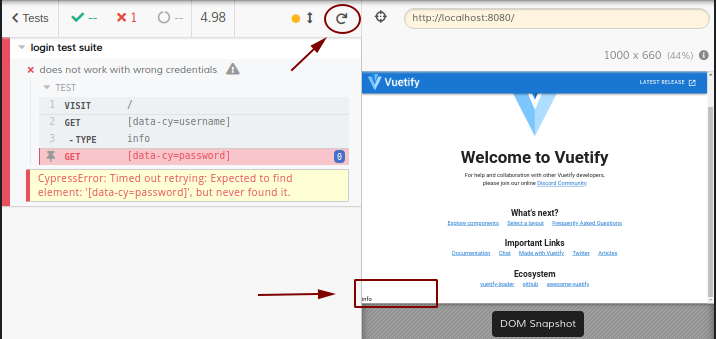
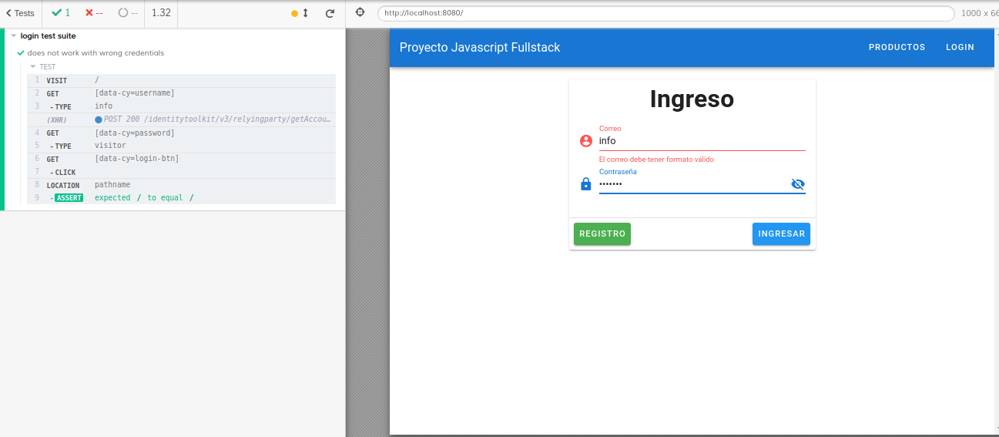
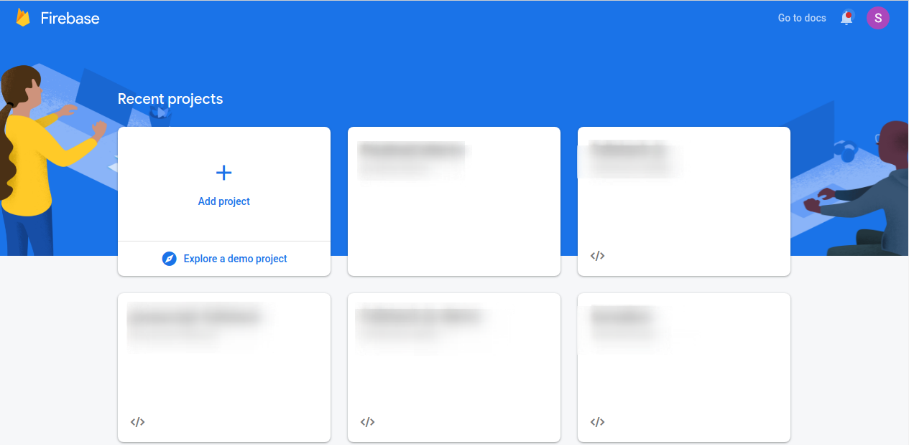
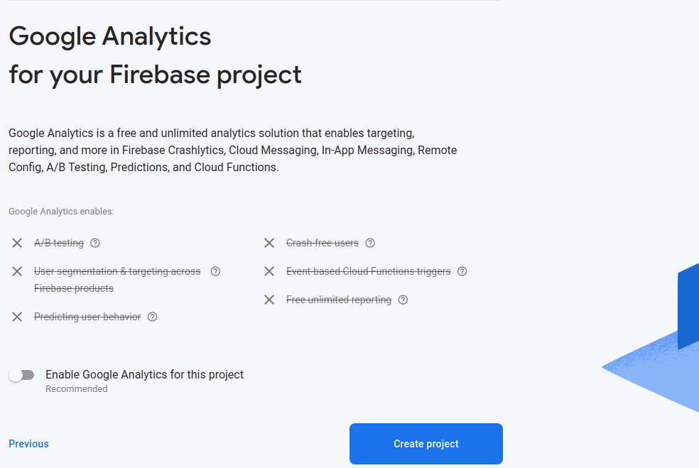
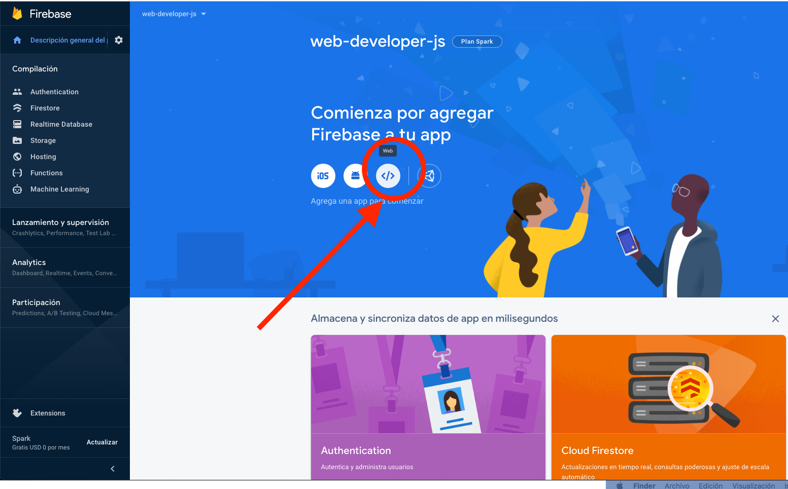
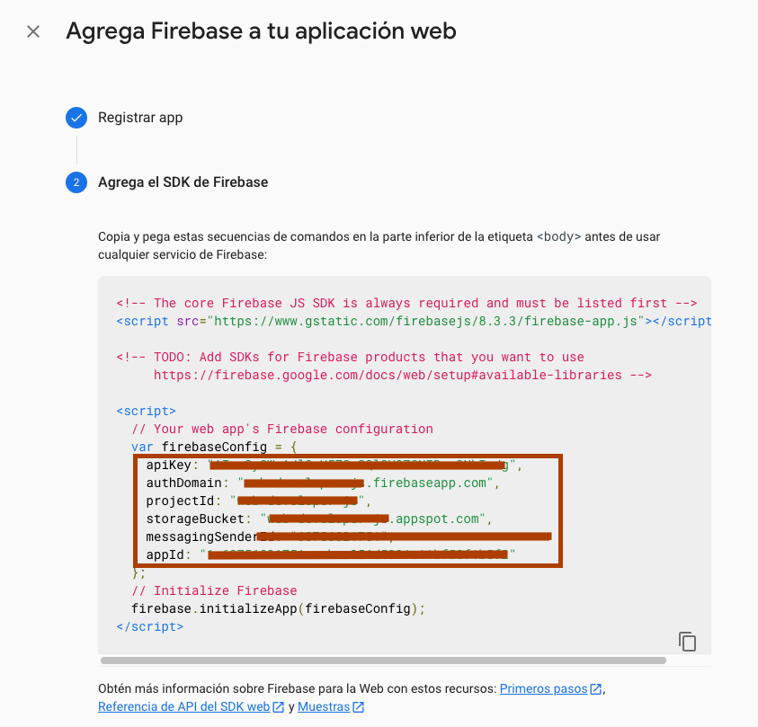
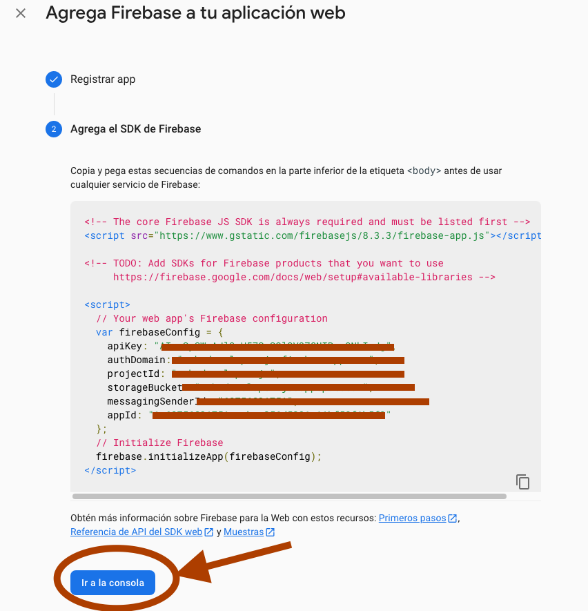
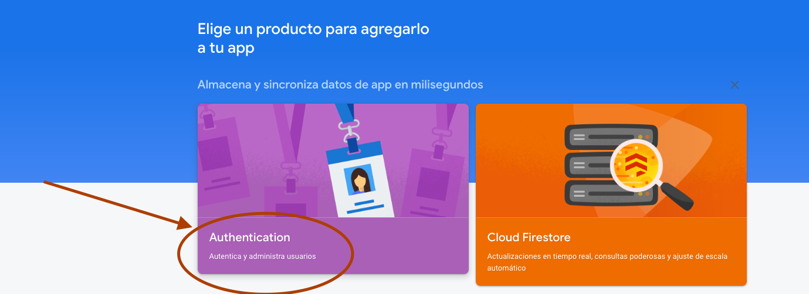
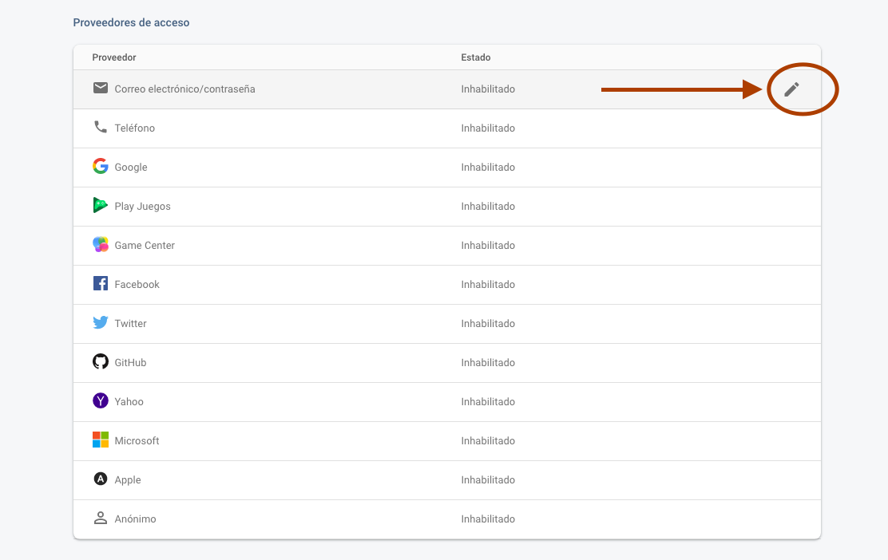

# Implementando historias de usuario con BDD

Comenzaremos a desarrollar siguiendo la metodología Behaviour Driven Design (abreviada como BDD). Si quieres conocer más en detalle acerca de ella te recomendamos ver [este video](https://www.youtube.com/watch?v=_bGtaCvaHLE&t=2959s). En resúmen se trata de una metodología para que personas no técnicas describan lo que esperan del software utilizando historias de usuario, las cuales describen las interacciones que hace un cierto tipo de usuario y el resultado esperado.

Nuestra primera historia de usuario es la siguiente:
```ruby
Funcionalidad: login de la aplicación

Escenario: login con credenciales inválidas

Como un usuario no registrado
Cuando ingreso a la aplicación 
Y completo el campo username con 'info'
Y el campo password con 'visitor' 
Entonces debería permanecer en la misma página
```

Como detallamos en el curso, estas historias de usuario se pueden transformar directamente en pruebas de aceptación utilizando conjuntamente la herramientas Cucumber y Cypress. Nosotros omitiremos este paso para enfocarnos en el desarrollo javascript y escribiremos directamente la historia de usuario utilizando la api de Cypress.

Para esto vamos a modificar la prueba e2e por defecto generada durante el proceso de creación. En concreto el archivo de llama `test.js`. Te puedes guiar por el siguiente esquema del proyecto:  

```
<tu-proyecto>
...
└─── public
└─── src
└─── tests
    └─── e2e
         └─── plugins
         └─── specs
                  test.js <-- vamos a renombrar este archivo
         └─── support
    └─── unit

...
```
Renombramos el archivo test.js indicado en la figura anterior y lo llamaremos simplemente `login.js`.
Luego cambiaremos su contenido a lo indicado en el siguiente código:

```javascript
describe('login test suite', () => {
  it('does not work with wrong credentials', () => {
    cy.visit('/')

    cy.get('[data-cy=username]').type('info')
    cy.get('[data-cy=password]').type('visitor')
    cy.get('[data-cy=login-btn]').click()

    cy.location('pathname').should('equal', '/')
  })
})
```

#### ¿Que significa este código?

Te preguntarás por qué utilizamos los atributo del tipo `data-cy=*` como selectores HTML en nuestra aplicación. Puedes ver el siguiente artículo desde el Blog oficial de Cypress en [este enlace](https://docs.cypress.io/guides/references/best-practices#Selecting-Elements). En resumen se trata de que las pruebas e2e sean independientes (no acopladas) a cambios en el diseño, resistente a los posibles cambios que podrían sufrir las tradicionales clases o ids.

Por supuesto que como aún no hemos escrito código, esta prueba de software comenzará fallando y será nuestro deber escribir el mínimo código necesario para hacerla pasar. Una vez que la prueba de software esté pasando, debemos refactorizar el código (si aplica) y mantener la prueba pasando. A este ciclo se le conoce como `Red - Green - Refactor`.

Para ver nuestra prueba fallando ejecutaremos el siguiente comando:

```shell
npm run test:e2e
```

Veremos aparecer la siguiente ventana:


Al hacer click sobre `login.js` aparecerá finalmente la prueba de software fallando como muestra la siguiente imagen:


Veremos una ventana del navegador en la cual al lado izquierdo están los pasos sucesivos que hemos escrito en la prueba de software y al lado derecho está nuestra aplicación.
Si nos fijamos en el panel izquierdo hay 2 instrucciones:

  ```
    1 VISIT /
    2 GET   [data-cy=username]
  ```
La primera instrucción hizo que nuestra aplicación navegará a la ruta raíz sin problemas, pero luego la segunda instrucción intentó encontrar en el HTML un elemento con el atributo `data-cy=username`. Esto lo vemos traducido en el siguiente mensaje de error:

```
CypressError: Timed out retrying: Expected to find element: '[data-cy=username]', but never found it.
```

Si vamos a revisar el código podremos encontrar las 2 líneas que desencadenaron las acciones del panel izquierdo:

```javascript
  cy.visit('/')
  cy.get('[data-cy=username]').type('info')
```
podemos ver como es que el comando `cy.get` es el que se usa para encontrar elementos HTML y luego interactuar con ellos.

#### ¿Cómo hacemos para pasar la prueba?

Como mencionamos anteriormente la metodología dice que la prueba de software debe pasar escribiendo el menor código posible. En este caso basta con que agreguemos cualquier etiqueta HTML que tenga el atributo `[data-cy=username]`. 

Para esto nos vamos a dirigir al archivo `src/App.vue` y agregaremos lo siguiente en la sección HTML (`<template>`), donde esta definido el elemento `<v-main>`

```html

  ...
  <v-main>
    <HelloWorld/>
    <!-- Este será el elemento que hará que la prueba deje de arrojar el error actual --->
    <input data-cy="username">
  </v-main>
  ...
```

Una vez agregado esto, guardamos el archivo y veremos que la terminal dirá `COMPILING`. Esperaremos que esto salga OK y luego vamos nuevamente a Cypress y presionamos el botón para recargar las pruebas  como se ve en al siguiente imagen



Veremos como al lado derecho aparece el input que agregamos y con valor `info`. Esto gracias al comando `.type` que ejecutamos sobre el elemento seleccionado.

Ahora veremos un nuevo mensaje de error:


```
CypressError: Timed out retrying: Expected to find element: '[data-cy=password]', but never found it.
```

Si hacemos un análisis de lo que está escrito en la prueba de software podemos deducir que necesitaremos otro input esta vez con el atributo `[data-cy="password"]` y luego un botón con el atributo `data-cy="login-btn"`.

Al agregar esto en el archivo `views/App.vue` quedará así:


```html

  ...
  <v-main>
    <HelloWorld/>

    <input data-cy="username">
    <input data-cy="password">
    <button data-cy="login-btn">Ingresar</button>
  </v-main>
  ...
```

Finalmente al recargar las pruebas veremos como es que ahora se puso de color verde lo que indica que la prueba está pasando.


#### Refactorización

Si bien la prueba está pasando, vemos que la interfaz de usuario no cumple el objetivo. Los elementos están definidos sin estilo y aún tenemos todo el código que agregó Vuetify en su instalación.
Modificaremos todo el código de la página inicial para que ahora sea un de Login utilizando Vuetify. Mantendremos corriendo Cypress mientras implementamos los cambios para que al terminar recarguemos las pruebas y nos aseguremos que siguen pasando.

Lo primero será modificar el archivo `src/App.vue` y reemplazaremos todo su contenido por lo siguiente:

```html

<template>
  <v-app>
    <v-main>
      <router-view></router-view>
    </v-main>
  </v-app>
</template>

<script>

export default {
  name: 'App'
}
</script>

```

Luego iremos al directorio `views`. Eliminamos el archivo `About.vue` y vamos a cambiar el nombre del archivo `Home.vue` por `Login.vue`. En cuanto guardemos esto veremos un error en la terminal pero lo solucionaremos de inmediato, cuando actualicemos el router.

Ahora vamos al archivo `Login.vue` y reemplazaremos todo su contenido con lo siguiente:

```html
<template>
  <v-main class="home">
    <v-card width="400px" class="mx-auto my-auto">
      <v-card-title class="pb-0">
        <h1 class="mx-auto mb-5">Ingreso</h1>
      </v-card-title>
      <v-form ref="form">
        <v-text-field
          v-model="email"
          label="Correo"
          prepend-icon="mdi-account-circle"
          :rules="emailRules"
          validate-on-blur
          data-cy="username"
        />
        <v-text-field
          v-model="password"
          label="Contraseña"
          :type="showPassword ? 'text' : 'password'"
          :rules="passwordRules"
          validate-on-blur
          prepend-icon="mdi-lock"
          :append-icon="showPassword ? 'mdi-eye' : 'mdi-eye-off'"
          @click:append="showPassword = !showPassword"
          data-cy="password"
        />
      </v-form>
      <v-divider />
      <v-card-actions>
        <v-btn to="/registro" color="success"> Registro </v-btn>
        <v-spacer />
        <v-btn color="info" data-cy="login-btn" @click="login"> Ingresar </v-btn>
      </v-card-actions>
    </v-card>
  </v-main>
</template>

<script>

export default {
  data () {
    return {
      email: '',
      emailRules: [
        (v) => !!v || 'El correo es requerido',
        (v) => /.+@.+\..+/.test(v) || 'El correo debe tener formato válido'
      ],
      password: '',
      passwordRules: [(v) => !!v || 'La contraseña es requerida'],
      showPassword: false
    }
  },
  methods: {
    login () {}
  }
}
</script>

```

y ahora actualizamos el archivo `src/router/index.js` con lo siguiente:

```javascript
import Vue from 'vue'
import VueRouter from 'vue-router'
import Login from '../views/Login.vue'

Vue.use(VueRouter)

const routes = [
  {
    path: '/',
    name: 'Login',
    component: Login
  }
]

const router = new VueRouter({
  mode: 'history',
  routes
})

export default router

```

Ahora recargamos las pruebas y deberíamos ver nuestras pruebas pasando y la interfaz más acorde al objetivo de negocio que estamos desarrollando mediante pruebas. El resultado sería similar a la siguiente imagen:




#### Integrando el servicio de autenticación de Firebase

Dado el contexto de nuestra aplicación, lo que haremos será enviar invitaciones manualmente a quienes publicarán productos para trueques y darles un usuario y contraseña de acceso que manejaremos directamente desde la interfaz de Firebase.

Si ya tienes cuenta de Google, puedes autenticarte y dirigirte a [https://console.firebase.google.com/](https://console.firebase.google.com/), donde veremos una pantalla como la siguiente:



Una vez dentro del admin de Firebase creamos un proyecto. 
Después de agregar el nombre nos pregunta si queremos incluir Analytics. Deshabilitar esta opción como en la siguiente imágen: .  Después se puede activar si se requiere. 

Cuando indique que el proyecto ha sido creado damos click en `continuar`. Posteriormente presionamos el botón indicado en la imagen para registrar nuestra aplicación de tipo Web:



Cuando lo presionemos nos dirá que le demos un nombre a nuestra aplicación y luego aparecerá lo siguiente:



Seleccionaremos lo que está remarcado en la imagen y lo llevaremos a un nuevo archivo que crearemos en el directorio `src`.
Primero vamos a crear el directorio en `src/firebase` y al interior de ese directorio crearemos 2 archivos llamados `config.js` e `index.js`.

```
<tu-proyecto>
...
└─── public
└─── src
     ...
    └─── firebase
            config.js
            index.js

...
```
el contenido de ambos archivos será el siguiente:

**config.js**

Los datos de este archivo los copiaremos de lo indicado en la imagen anterior.
```javascript
export default {
  apiKey: ''
  authDomain: ''
  projectId: ''
  storageBucket: ''
  messagingSenderId: ''
  appId: '',
}

```

**index.js**

```javascript
import firebase from 'firebase/app'
import 'firebase/auth'
import config from './config'

const firebaseApp = firebase.initializeApp(config)

const Auth = firebaseApp.auth()

export { Auth }

```

Ahora debemos instalar `firebase` en el proyecto. Para ello ejecutamos el siguiente comando en una terminal aparte para mantener corriendo Cypress:

```bash
npm install firebase
```

Con esto nuestro proyecto quedará preparado para conectarnos a Firebase llegado el momento.

Ahora volvemos a la interfaz de Firebase donde nos quedamos anteriormente y presionamos el botón `Ir a la consola`:



Finalmente habilitaremos la autenticación a través de correo electrónico/contraseña desde la consola de Firebase siguiendo estos pasos:

Presionamos desde el panel de control la opción `Authentication` como muestra la siguiente imagen:



Nos llevará a otra pantalla donde debemos presionar `Comenzar` y eso hará aparecer todas las opciones disponibles para la autenticación. Por defecto todos los tipos de autenticación vienen desactivados. Para habilitar la autenticación con correo electrónico/Contraseña  y presionamos el botón editar donde se indica:



Y finalmente habilitamos este servicio y presionamos "Guardar". Notar que mantenemos desactivada la opción `Vínculo del correo electrónico (acceso sin contraseña)


Ahora crearemos un usuario presionando el tab `Users` tal como se indica en la siguiente imagen:


Presionamos el Botón `Agregar usuario` y crearemos un usuario con el siguiente perfil:

```
Correo electrónico: test-e2e@boolean.cl
Contraseña: booleanacademia

```


Si quieres puede elegir otro correo electrónico y contraseña y reemplazarlo donde corresponda.
Indicamos que este usuario, a pesar de estár en entorno productivo, será solamente para realizar pruebas. 

#### Un nuevo escenario en la historia de usuario para realizar una autenticación exitosa

Ahora trabajaremos el caso (escenario en historias de usuario) exitóso
de la autenticación. La historia sería como sigue:

```ruby
Funcionalidad: login de la aplicación
...
Escenario: login con credenciales válidas

Como un usuario no registrado
Cuando ingreso a la aplicación 
Y completo el campo username con 'test-e2e@boolean.cl'
Y el campo password con 'booleanacademia' 
Entonces debería ver la página de productos

```

Escribiremos una nueva prueba de software basada en la historia de usuario que consistirá en autenticarse en Firebase con los datos de prueba y validar que la aplicación nos lleve a la página `/productos`.

Vamos a editar el archivo `tests/e2e/specs/login.js` y reemplazar su contenido por lo siguiente:

```javascript
describe('login test suite', () => {
  it('does not work with wrong credentials', () => {
    cy.visit('/')

    cy.get('[data-cy="username"]').type('info')
    cy.get('[data-cy="password"]').type('visitor')
    cy.get('[data-cy="login-btn"]').click()

    cy.location('pathname').should('equal', '/')
  })

  it('does work with valid credentials', () => {
    cy.visit('/')

    cy.get('[data-cy="username"]').type('test-e2e@boolean.cl')
    cy.get('[data-cy="password"]').type('booleanacademia')
    cy.get('[data-cy="login-btn"]').click()

    cy.location('pathname').should('equal', '/productos')
  })
})

```
Ahora recargamos Cypress y veremos el siguiente error:


Ahora vamos a escribir el código más simple que sea capaz de dejar pasando esta prueba. Vamos al archivo `src/views/Login.vue` y agregamos el siguiente contenido al metodo `login()`

```javascript
  ...
  methods: {
    login () {
      this.$router.push({ name: 'Products' })
    }
  }
  ...
```
Luego vamos a crear un nuevo archivo en `src/views` llamado `Products.vue` con el siguiente contenido:

```html
<template>
  <v-main>
    <h1>Productos</h1>
  </v-main>
</template>

<script>
export default {

}
</script>

```

Luego vamos al archivo `src/router/index.js` y reemplazamos su contenido por el siguiente:

```javascript
import Vue from 'vue'
import VueRouter from 'vue-router'
import Login from '../views/Login.vue'
import Products from '../views/Products.vue'

Vue.use(VueRouter)

const routes = [
  {
    path: '/',
    name: 'Login',
    component: Login
  },
  {
    path: '/productos',
    name: 'Products',
    component: Products
  }
]

const router = new VueRouter({
  mode: 'history',
  routes
})

export default router

```

Al recargar vemos que la nueva prueba si está pasando pero estos cambios provocaron que se cayera la prueba anterior:


Excelente! esto es lo que debería pasar en un flujo de trabajo guiado por pruebas de software: Los cambios ejecutados en el código eventualmente podrían afectar a otras pruebas por lo que es nuestro deber que el mínimo código que agregamos para pasar una prueba sea capaz de mantener todas las otras pruebas pasando y no sólo la que acabamos de escribir.

Para solucionar esto usaremos la `refs` que hemos asociado al elemento `v-form` para crear una función que valide si el formulario está correcto. A través de la `refs` obtendremos la instancia del elemento `v-form` y podremos utilizar su API para usar el método `validate`. Si quieres ver más detalle sobre la API de este elemento puedes visitar el [siguiente enlance](https://vuetifyjs.com/en/api/v-form/#functions-validate)
Iremos a modificar el archivo `src/views/Login.vue` y agregamos lo siguiente en la sección `methods`

```javascript
  ...
  methods: {
    validate () {
      return this.$refs.form.validate()
    },
    login () {
      if (this.validate()) {
        this.$router.push({ name: 'Products' })
      }
    }
  }
  ...
```

y al recargar las pruebas podemos ver como ambas están pasando. Excelente trabajo!

Tip: Revisa la consola por errores de identación que puedan entorpecer la "compilación"

Ahora debemos hacer una refactorización para lograr una conexión real con el servicio de Firebase. Lo que haremos será modificar la sección `<script>` del archivo `src/views/Login.vue` por lo siguiente:

```javascript
<script>
import { Auth } from '@/firebase'

export default {
  data () {
    return {
      email: '',
      emailRules: [
        (v) => !!v || 'El correo es requerido',
        (v) => /.+@.+\..+/.test(v) || 'El correo debe tener formato válido'
      ],
      password: '',
      passwordRules: [(v) => !!v || 'La contraseña es requerida'],
      showPassword: false
    }
  },
  methods: {
    validate () {
      return this.$refs.form.validate()
    },
    async login () {
      if (this.validate()) {
        await Auth.signInWithEmailAndPassword(this.email, this.password)
        this.$router.push({ name: 'Products' })
      }
    }
  }
}
</script>

```

Podemos notar como es que importamos el código de firebase que agregamos al comienzo de este capítulo. La función que efectúa la integración del logín es `signInWithEmailAndPassword` que puedes ver en la misma [documentación](https://firebase.google.com/docs/auth/web/password-auth#sign_in_a_user_with_an_email_address_and_password). Ahora al recargar las pruebas estas deberían seguir funcionando.


#### Página de productos

Continuamos con con la siguiente historia de usuario. Esta vez con la vista de los productos.

```ruby
Funcionalidad: página de productos

Escenario: Listado simple

Como un usuario que inició sesión en la aplicación
Cuando ingreso a la página de productos
Entonces debería ver una lista de productos

```

Ahora escribiremos una prueba basada en la historia. Para esto crearemos un nuevo archivo en el directorio `tests/e2e/specs` y lo llamaremos `products.js`. Ahora agregaremos el siguiente contenido:


```javascript
describe('products test suite', () => {
  it('shows a list of products',() => {
    cy.visit('/')

    cy.get('[data-cy=username]').type('test-e2e@boolean.cl')
    cy.get('[data-cy=password]').type('booleanacademia')
    cy.get('[data-cy=login-btn]').click()

    cy.fixture('products.json')
      .then((products)=>{
        cy.get('[data-cy="products"] li').should('have.length', products.length)
      });
  })
})

```
Si ejecutamos esta prueba veremos que falla por los fixtures, pero nos encargaremos de eso más adelante. 

En esta prueba vemos que es la tercera vez que escribimos las instrucciones para realizar una autenticación. Por suerte Cypress permite agrupar comandos comunes en funciones que podemos centralizar y reutilizar.
Para lograr esto iremos al archivo `tests/e2e/support/commands.js` y descomentaremos la linea indicada en la siguiente imagen:


y los reemplazaremos por lo siguiente:

```javascript
Cypress.Commands.add("login", (email, password) => {
  cy.visit('/')

  cy.get('[data-cy=username]').type(email)
  cy.get('[data-cy=password]').type(password)
  cy.get('[data-cy=login-btn]').click()  
})
```

y luego iremos a editar los archivos en el directorio `tests/e2e/specs` y reemplazaremos cada uno con el código correspondiente:

**login.js**

```javascript
describe('login test suite', () => {
  it('does not work with wrong credentials', () => {
    cy.login('info', 'visitor')

    cy.location('pathname').should('equal', '/')
  })

  it('does work with valid credentials', () => {
    cy.login('test-e2e@boolean.cl', 'booleanacademia')

    cy.location('pathname').should('equal', '/productos')
   })
});
```

**products.js**

```javascript
describe('products test suite', () => {
  it('shows a list of products',() => {
    cy.login('test-e2e@boolean.cl', 'booleanacademia')

    cy.fixture('products.json')
      .then((products)=>{
        cy.get('[data-cy="product-item"]').should('have.length', products.length)
      })
  })
})

```

Ahora cerraremos la ventana del navegador para volver al menu principal de Cypress en el cuál veremos incluido el nuevo archivo. Ahora presionamos el botón que dice `Run all specs` que debería lucir como la siguiente imagen:


Y veremos el siguiente error:


#### ¿Qué son los Fixtures ?

El error de la anterior prueba es porque aún no creamos el archivo `products.json`. Al revisar más en detalle podemos revisar que el siguiente código es el que causa el problema

```javascript
cy.fixture('products.json')
  .then((products)=>{
    cy.get('[data-cy=product-item]').should('have.length', products.length)
  })

```

¿Para que agregamos este código?

Un `Fixture` es información estática que permite que las pruebas de software sean repetibles en el tiempo. En otras palabras es un estado fijo que se le carga a las pruebas a través de los fixtures. En nuestro caso asumiremos la existencia de un archivo `products.json` que contendrá esta información. Este simple archivo estático cobra relevancia por que sirve de punto de encuentro entre las personas de negocio y los desarrolladores Backend y Frontend. 

Si vamos al archivo `tests/e2e/plugins/index.js` veremos entre otras configuraciones una en particular que dice lo siguiente:

```javascript
  fixturesFolder: 'tests/e2e/fixtures',
```
En esta linea de código se define desde donde Cypress va a leer los archivos Fixture. Lo haremos será crear una carpeta llamada `fixtures ` en `tests/e2e` tal como lo indica la línea de código que estamos analizando. dentro de esta nueva carpeta agregaremos un archivo llamado `products.json` con el siguiente contenido:

**products.json**

```json
[
  {
    "id": 1,
    "name": "Epiphone Explorer Gothic ",
    "description": "Guitarra color negro",
    "image": "https://images.unsplash.com/photo-1550985616-10810253b84d?ixlib=rb-1.2.1&ixid=MXwxMjA3fDB8MHxwaG90by1wYWdlfHx8fGVufDB8fHw%3D&auto=format&fit=crop&w=742&q=80",
    "code": "0001"
  },
  {
    "id": 2,
    "name": "Cordoba Mini Bass",
    "description": "Bajo pequeño tipo ukelele. Excelente sonido de bajo.",
    "image": "https://images.unsplash.com/photo-1556449895-a33c9dba33dd?ixid=MXwxMjA3fDB8MHxwaG90by1wYWdlfHx8fGVufDB8fHw%3D&ixlib=rb-1.2.1&auto=format&fit=crop&w=2734&q=80",
    "code": "0002"
  },
  {
    "id": 3,
    "name": "Distorsión Custom Badass 78",
    "description": "Peda del guitarra de distorsión.",
    "image": "https://images.unsplash.com/photo-1527865118650-b28bc059d09a?ixlib=rb-1.2.1&ixid=MXwxMjA3fDB8MHxwaG90by1wYWdlfHx8fGVufDB8fHw%3D&auto=format&fit=crop&w=668&q=80",
    "code": "0003"
  },
  {
    "id": 4,
    "name": "Distorsión TMiranda Bass Drive BD-1",
    "description": "Pedal del bajo de distorsión.",
    "image": "https://images.unsplash.com/photo-1614963590047-0b8b9daa3eb7?ixid=MXwxMjA3fDB8MHxwaG90by1wYWdlfHx8fGVufDB8fHw%3D&ixlib=rb-1.2.1&auto=format&fit=crop&w=2089&q=80",
    "code": "0004"
  },
  {
    "id": 5,
    "name": "Looper Hotone Wally",
    "description": "Pedal de looper. Super portable.",
    "image": "https://images.unsplash.com/photo-1595167151695-dfb4846e70f8?ixid=MXwxMjA3fDB8MHxwaG90by1wYWdlfHx8fGVufDB8fHw%3D&ixlib=rb-1.2.1&auto=format&fit=crop&w=668&q=80",
    "code": "0005"
  }
]

```

Ahora deberíamos obtener un nuevo error en Cypress, ya que la prueba esperaba encontrar cinco (5) elementos con el atributo `data-cy=product-item`, pero encuentra cero (0) como indica la siguiente imagen:


Al igual que las veces anteriores escribiremos el código lo más simple posible para pasar esta prueba.

Modificamos el archivo `src/views/Products.vue` y agregaremos lo siguiente en la sección `<template>`:

```html
<template>
  <v-main>
    <h1>Productos</h1>

    <section>
      
      
      
      
      
    </section>
  </v-main>
</template>
```

Guardamos, recargamos las pruebas en Cypress y vemos que todas la prueba está pasando:


Para la refactorización nos basaremos en el ejemplo de Vuetify presentado en el siguiente [enlace](https://vuetifyjs.com/en/components/images/#grid).

Modificamos completo el archivo `src/views/Products.vue` con el siguiente contenido:

```html
<template>
  <v-main>
    <h1>Productos</h1>

    <section data-cy="products">
      <v-row>
        <v-col
          v-for="product in products"
          :key="product.id"
          cols="4"
          data-cy="product-item"
        >
          <h3>{{ product.name }}</h3>
          <v-img
            :src="product.image"
            lazy-src="https://via.placeholder.com/300"
            aspect-ratio="1"
            class="grey lighten-2"
          >
            <template v-slot:placeholder>
              <v-row
                class="fill-height ma-0"
                align="center"
                justify="center"
              >
                <v-progress-circular
                  indeterminate
                  color="grey lighten-5"
                ></v-progress-circular>
              </v-row>
            </template>
          </v-img>

          <p>{{ product.description }}</p>
        </v-col>
      </v-row>
    </section>
  </v-main>
</template>

<script>
export default {
  data () {
    return {
      products: [
        {
          id: 1,
          name: 'Epiphone Explorer Gothic ',
          description: 'Guitarra color negro',
          image: 'https://images.unsplash.com/photo-1550985616-10810253b84d?ixlib=rb-1.2.1&ixid=MXwxMjA3fDB8MHxwaG90by1wYWdlfHx8fGVufDB8fHw%3D&auto=format&fit=crop&w=742&q=80',
          code: '0001'
        },
        {
          id: 2,
          name: 'Cordoba Mini Bass',
          description: 'Bajo pequeño tipo ukelele. Excelente sonido de bajo.',
          image: 'https://images.unsplash.com/photo-1556449895-a33c9dba33dd?ixid=MXwxMjA3fDB8MHxwaG90by1wYWdlfHx8fGVufDB8fHw%3D&ixlib=rb-1.2.1&auto=format&fit=crop&w=2734&q=80',
          code: '0002'
        },
        {
          id: 3,
          name: 'Distorsión Custom Badass 78',
          description: 'Peda del guitarra de distorsión.',
          image: 'https://images.unsplash.com/photo-1527865118650-b28bc059d09a?ixlib=rb-1.2.1&ixid=MXwxMjA3fDB8MHxwaG90by1wYWdlfHx8fGVufDB8fHw%3D&auto=format&fit=crop&w=668&q=80',
          code: '0003'
        },
        {
          id: 4,
          name: 'Distorsión TMiranda Bass Drive BD-1',
          description: 'Pedal del bajo de distorsión.',
          image: 'https://images.unsplash.com/photo-1614963590047-0b8b9daa3eb7?ixid=MXwxMjA3fDB8MHxwaG90by1wYWdlfHx8fGVufDB8fHw%3D&ixlib=rb-1.2.1&auto=format&fit=crop&w=2089&q=80',
          code: '0004'
        },
        {
          id: 5,
          name: 'Looper Hotone Wally',
          description: 'Pedal de looper. Super portable.',
          image: 'https://images.unsplash.com/photo-1595167151695-dfb4846e70f8?ixid=MXwxMjA3fDB8MHxwaG90by1wYWdlfHx8fGVufDB8fHw%3D&ixlib=rb-1.2.1&auto=format&fit=crop&w=668&q=80',
          code: '0005'
        }
      ]
    }
  }
}

</script>

```
Notarás que hicimos una copia del contenido del archivo `products.json` que agregamos como fixture anteriormente. Esto será de utilidad ya que ahora nuestra aplicación implementa "el contrato" JSON del archivo y esta mostrando los atributos en función de esta lista.

Al recargar Cypress veremos que luego de hacer los cambios en el código nuestra prueba sigue pasando:


#### Agregando Axios y haciendo una petición al Servidor

Ya hemos modelado y escrito las pruebas necesarias para que nuestra aplicación cuente con la funcionalidad básica que permita mostrar una lista de productos luego de una autenticación. Pero la última funcionalidad que escribimos muestra una lista estática de productos. Ha llegado el momento de realizar una consulta a un servidor que nos entregue la información de los productos acorde al contrato JSON que modelamos utilizando Fixtures.

Sin dejar de correr Cypress, abriremos una nueva terminal en el proyecto e instalaremos la librerías `Axios` utilizando el siguiente comando:

```bash
npm install axios
```

Si quieres conocer más sobre su documentación te recomendamos mirar [este enlace](https://github.com/axios/axios#axios-api).


Ahora iremos al archivo `src/store` y reemplazaremos su contenido por lo siguiente:

```javascript
import Vue from 'vue'
import Vuex from 'vuex'
import axios from 'axios'

Vue.use(Vuex)

export default new Vuex.Store({
  state: {
    products: []
  },
  mutations: {
    SET_PRODUCTS (store, products) {
      store.products = products
    }
  },
  actions: {
    async getProducts (actionContext) {
      const { commit } = actionContext
      const productsURL = '/api/products'

      try {
        const response = await axios.get(productsURL)
        commit('SET_PRODUCTS', response.data)
      } catch (error) {
        console.log(error.message)
      }
    }
  },
  modules: {
  }
})

```

Con esto dejaremos lista una acción de `Vuex` que nos permitirá desde nuestro componente ejecutar la acción `getProducts` que agregará al estado de la aplicación los productos desde un servidor externo. El servidor deberá responder los productos basados en el contrato que consume nuestro componente `Products`.

Ahora iremos al archivo `src/views/Login.vue` y editaremos la sección `<script>` de la siguiente manera:

```html
<script>
import { mapActions, mapState } from 'vuex'

export default {
  computed: {
    ...mapState([
      'products'
    ])
  },
  methods: {
    ...mapActions([
      'getProducts'
    ])
  },
  created () {
    this.getProducts()
  }
}
</script>

```

Al recargar Cypress vamos a notar que las pruebas vuelven a fallar. 


Esto quiere decir que nuestro componente está tomando el valor por defecto desde el `store` y eso hace fallar las pruebas.

Si quieres entender mejor los métodos como `created` que se ejecuta cuando el componente se inicializa en Vue puedes revisar el [siguiente enlace](https://v3.vuejs.org/api/options-lifecycle-hooks.html#created)

Y si quieres conocer como el store de Vuex nos permite agregar acciones al componente para ejecutarlas cuando sea necesario puedes ver [este enlace](https://vuex.vuejs.org/guide/actions.html#dispatching-actions-in-components)

Además en la imagen anterior vemos resaltado la petición al servidor que se hizo y que Cypress nos informa que ha recibido como respuesta un error de tipo `404`


```
(XHR) GET 404 /api/products

```

Esto es debido a que en nuestro componente realiza al inicializarse un llamado a la acción `getProducts` configurada en nuestro Store de Vuex. Esto lo podemos ver en el método `created()` del componente en `src/views/Products.vue`

```javascript
methods: {
  ...mapActions([
    'getProducts'
  ])
},
created () {
  this.getProducts()
}
```

Para que esta prueba pase necesitaremos un servidor que responda la petición a la url `http://localhost:8080/api/products`. ¿Como lograremos esto? Lo resolveremos en el siguiente capítulo.

<table>
  <tr>
    <th colspan="2">
      <a href="./01-vue-cli-install.md">
        <span>⬅️ </span>Creando un proyecto usando CLI y framework UI
      </a>
    </th>
    <th colspan="2">
      <a href="./03-monorepo-backend.md"> Reorganización del proyecto como un repositorio monolítico y agregar Backend
        <span>➡️ </span>
      </a>
    </th>
  </tr>
</table>
