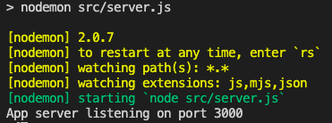
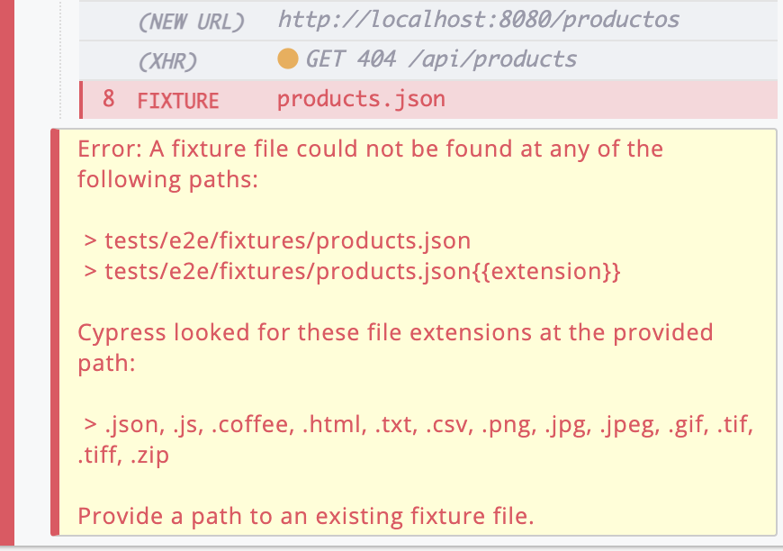
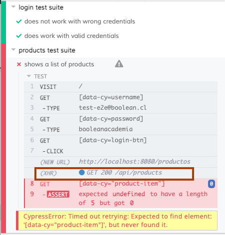

# Reorganización del proyecto como un repositorio monolítico y agregar Backend

En función de la metodología que estamos utilizando lo que haremos será centralizar en este mismo repositorio todo lo necesario para que nuestras pruebas de software pasen sin problema. En este caso nuestras pruebas end-to-end requieren que el frontend realice una petición exitosa hacia un backend que aún no existe. Este debe ser capaz de responder a una petición de tipo GET a una URL que exponga el endpoint `/api/products`.

En función de esta necesidad lo que haremos será reorganizar el repositorio siquiendo algunos lineamientos:

  - Dividiremos el repositorio en 2 dominios: Frontend y Backend donde cada dominio representará un objetivo dentro de la plataforma que expondremos cuando salgamos a producción. En este caso el Frontend será el sitio Web donde el usuario interactuará y el Backend quien provea la información a este sitio consultando los datos requeridos a una Base de datos.
  - Vamos a crear un directorio en la raíz para centralizar todos los Fixtures que contendrán los datos de prueba que le serán útiles tanto al dominio de Backend como Frontend
  - Cuando ambos dominios de negocio estén listos para salir a producción estableceremos procedimientos de calidad en el repositorio que validen la sintáxis de Frontend y Backend así como las pruebas de software que validen el comportamiento del proyecto antes que se hagan subidas al repositorio remoto de forma automatizada

Primero cancelaremos la ejecución de Cypress (cmd+C o ctrl+C) y luego
implementaremos estos lineamientos dejando el repositorio como indica el siguiente esquema: 

```
<tu-proyecto>
└─── backend
└─── frontend <-- acá movemos todo el código generado hasta el momento
      .browserslistrc
      .env.production
      .eslintrc.js
      README.md
      babel.config.js
      cypress.json
      jest.config.js
      node_modules
      package-lock.json
      package.json
      public
      src
      tests
      vue.config.js
```

Ahora tomaremos la carpeta fixtures que se encuentra en `frontend/tests/e2e` y la moveremos hacia la raíz como se indica en el siguiente esquema:
También aprovecharemos de crear un directorio `src` dentro de la carpeta `backend` que será donde escribiremos el código del servidor.

```
<tu-proyecto>
└─── backend
    └─── src <-- acá escribiremos el código del servidor
└─── fixtures <-- movemos la carpeta fixtures a la raíz del proyecto
      products.json
└─── frontend
      .browserslistrc
      .env.production
      .eslintrc.js
      README.md
      babel.config.js
      cypress.json
      jest.config.js
      node_modules
      package-lock.json
      package.json
      public
      src
      tests 
      └─── e2e  <-- movemos la carpeta fixtures que habiamos creado anteriormente 
          └─── plugins
          └─── specs
          └─── support
          .eslinrc.js
      vue.config.js
```
La implementación de las validaciones automatizadas de linter y pruebas de software la dejaremos más adelante para cuando ya tengamos listos los proyectos de Frontend y Backend.

Comenzaremos a desarrollar el proyecto Backend así que lo primero que haremos será entrar al directorio `backend` desde la terminal y una vez ahí ejecutaremos lo siguiente:

```bash
npm init -f
npm install express cors
npm install --save-dev nodemon
```
Ahora crearemos un nuevo archivo en `backend/src` y crearemos un archivo llamado `server.js` con el siguiente contenido:

**backend/src/server.js**
```javascript
const express = require("express")
const app = express()
const port = 3000

app.use('/api/products', (request, response) => {
  const statusCode = 200
  console.log(`GET with status code ${statusCode} in /api/products endpoint`);
  return response
    .status(statusCode)
    .json([])
})

app.listen(port, () => {
  console.log(`App server listening on port ${port}`);
})

```
Una vez ejecutado esto deberiamos ver el directorio `backend` de la siguiente forma

```
└─── backend
    └─── node_modules
    └─── src
         server.js
    package.json
    package-lock.json

```

Modificaremos el `backend/package.json` y quedará de la siguiente forma:

```json
{
  "name": "backend",
  "version": "1.0.0",
  "description": "",
  "main": "index.js",
  "scripts": {
    "start": "nodemon src/server.js",
    "test": "echo \"Error: no test specified\" && exit 1"
  },
  "keywords": [],
  "author": "",
  "license": "ISC",
  "dependencies": {
    "cors": "^2.8.5",
    "express": "^4.17.1"
  },
  "devDependencies": {
    "nodemon": "^2.0.7"
  }
}

```
Con esto ya podremos levantar el servidor preocupandonos de estar dentro del directorio `backend` ejecutamos:

```bash
npm start
```

Veremos que nuestro servidor ya está corriendo como en la siguiente imagen:



Ahora abriremos otra ventana de la terminal y nos dirigiremos al directorio `frontend`. Una vez dentro ejecutamos nuevamente el comando para abrir Cypress y nuestra aplicación:

```bash
npm run test:e2e
```
Una vez veamos la interfaz de Cypress, presionamos el botón `run all specs` y veremos el siguiente error:



Esto es debido a que en los pasos anteriores movimos la carpeta `fixtures` desde su ubicación hacia la raíz del proyecto.
Para solucionar esto nos dirigimos al archivo `frontend/tests/e2e/plugins/index.js` y reemplazamos completamente su contenido:

```javascript
/* eslint-disable arrow-body-style */
// https://docs.cypress.io/guides/guides/plugins-guide.html

// if you need a custom webpack configuration you can uncomment the following import
// and then use the `file:preprocessor` event
// as explained in the cypress docs
// https://docs.cypress.io/api/plugins/preprocessors-api.html#Examples

// /* eslint-disable import/no-extraneous-dependencies, global-require */
// const webpack = require('@cypress/webpack-preprocessor')
const path = require('path')

module.exports = (on, config) => {
  // on('file:preprocessor', webpack({
  //  webpackOptions: require('@vue/cli-service/webpack.config'),
  //  watchOptions: {}
  // }))
  const fixturesFolder = path.join(path.resolve('.'), '../fixtures')

  return Object.assign({}, config, {
    fixturesFolder,
    integrationFolder: 'tests/e2e/specs',
    screenshotsFolder: 'tests/e2e/screenshots',
    videosFolder: 'tests/e2e/videos',
    supportFile: 'tests/e2e/support/index.js'
  })
}

```

Debido a que hicimos una modificación en una propiedad necesaria para ejecutar `Cypress` tenemos que detener su ejecución y volver a realizarla.

Una vez que este corriendo `Cypress` veremos que aún persiste un error debido a que seguimos viendo un `GET 404 /api/products`.
En la siguiente imagen se muestra como tenemos 2 terminales corriendo y en la que muestra la salida de la interfaz de Cypress podemos identificar la llamada que está dando `error 404`:


Esto es porque si bien ya tenemos un servidor que responde al endpoint `/api/products` nuestra aplicación pide la información a `http://localhost:8080` y nuestro servidor corre en la url `http://localhost:3000`.

Para solucionar esto tendremos que una vez más detener la ejecución de Cypress ya que esta vez haremos una modificación en la configuración de `Vue`. Para ello iremos al archivo `frontend/vue.config.js` y reemplazaremos todo su contenido por lo siguiente:

```javascript
module.exports = {
  transpileDependencies: [
    'vuetify'
  ],
  devServer: {
    proxy: {
      '^/api': {
        target: 'http://localhost:3000'
      }
    }
  }
}
```
Esto permitirá que mientras estemos desarrollando la llamadas XHR al servidor sean redireccionadas hacia `localhost:3000`. Esto tiene sentido solo en el ambiente local de desarrollo ya que en nuestro caso particular en producción las llamadas desde el Frontend hacia el Backend serán bajo el mismo dominio.

Ahora volvemos a correr el comando `npm run test:e2e` estando en la terminal en el repositorio `frontend`, luego de ejecutar todas las pruebas veremos como siguen fallando pero que la respuesta de la llamada al servidor ahora dice `GET 200 /api/products` como se muestra en la siguiente imagen:



y veremos lo siguiente en la salida de la terminal del servidor:


Podemos ver que se hicieron 2 llamadas al endpoint `/api/products`. esto es debido a que en la primera prueba de autenticación exitosa también se hace un llamado a la página de productos.

Ahora iremos al archivo `backend/src/server.js` y lo reemplazaremos por lo siguiente:

**backend/src/server.js**
```javascript
const express = require("express")
const app = express()
const port = 3000

app.use('/api/products', (request, response) => {
  const statusCode = 200
  const products = [
    {
      id: 1,
      name: 'Epiphone Explorer Gothic ',
      description: 'Guitarra color negro',
      image: 'https://images.unsplash.com/photo-1550985616-10810253b84d?ixlib=rb-1.2.1&ixid=MXwxMjA3fDB8MHxwaG90by1wYWdlfHx8fGVufDB8fHw%3D&auto=format&fit=crop&w=742&q=80',
      code: '0001'
    },
    {
      id: 2,
      name: 'Cordoba Mini Bass',
      description: 'Bajo pequeño tipo ukelele. Excelente sonido de bajo.',
      image: 'https://images.unsplash.com/photo-1556449895-a33c9dba33dd?ixid=MXwxMjA3fDB8MHxwaG90by1wYWdlfHx8fGVufDB8fHw%3D&ixlib=rb-1.2.1&auto=format&fit=crop&w=2734&q=80',
      code: '0002'
    },
    {
      id: 3,
      name: 'Distorsión Custom Badass 78',
      description: 'Peda del guitarra de distorsión.',
      image: 'https://images.unsplash.com/photo-1527865118650-b28bc059d09a?ixlib=rb-1.2.1&ixid=MXwxMjA3fDB8MHxwaG90by1wYWdlfHx8fGVufDB8fHw%3D&auto=format&fit=crop&w=668&q=80',
      code: '0003'
    },
    {
      id: 4,
      name: 'Distorsión TMiranda Bass Drive BD-1',
      description: 'Pedal del bajo de distorsión.',
      image: 'https://images.unsplash.com/photo-1614963590047-0b8b9daa3eb7?ixid=MXwxMjA3fDB8MHxwaG90by1wYWdlfHx8fGVufDB8fHw%3D&ixlib=rb-1.2.1&auto=format&fit=crop&w=2089&q=80',
      code: '0004'
    },
    {
      id: 5,
      name: 'Looper Hotone Wally',
      description: 'Pedal de looper. Super portable.',
      image: 'https://images.unsplash.com/photo-1595167151695-dfb4846e70f8?ixid=MXwxMjA3fDB8MHxwaG90by1wYWdlfHx8fGVufDB8fHw%3D&ixlib=rb-1.2.1&auto=format&fit=crop&w=668&q=80',
      code: '0005'
    }
  ]
  
  console.log(`GET with status code ${statusCode} in /api/products endpoint`);
  
  
  return response
    .status(statusCode)
    .json(products)
})

app.listen(port, () => {
  console.log(`App server listening on port ${port}`);
})

```

Como verás al igual como lo hicimos en el cápitulo anterior con el Frontend, hemos copiado la lista del archivo `fixtures/products.json` para responder esa lista de productos.
Una vez guardemos el archivo `backend/src/server.js` veremos que la terminal donde está corriendo el servidor dice 

```bash
[nodemon] restarting due to changes...
[nodemon] starting `node src/server.js`
```

Así que nuestro servidor ya está actualizado. Ahora simplemente presionamos en botón recargar en Cypress y veremos que nuestras pruebas nuevamente están pasando.


