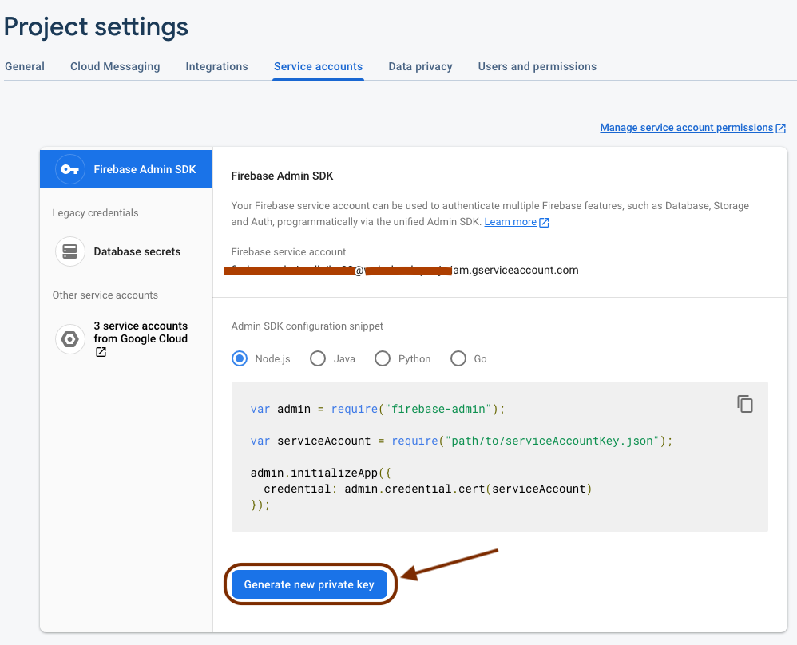
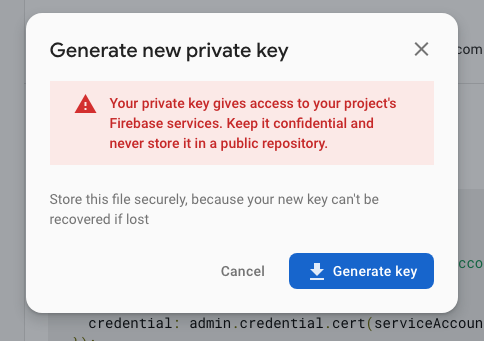
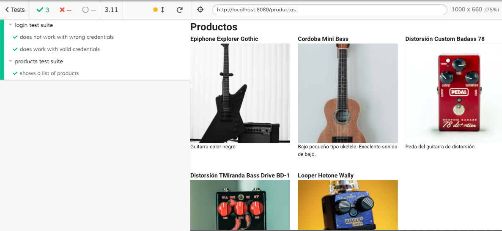

# Validar autenticación en el Backend

<div class="embed-responsive">
  <iframe
    class="embed-responsive__item"
    src="https://www.youtube.com/embed/TOPXHhmyARg"
    title="YouTube video player"
    frameborder="0"
    allow="accelerometer; autoplay; clipboard-write; encrypted-media; gyroscope; picture-in-picture" allowfullscreen
  ></iframe>
</div>

Firebase hace muy simple la comprobación de tokens de autorización en el Backend. En resumen, debemos enviar una cabecera específica desde el Frontend y con la biblioteca de Firebase integrada a nuestro backend podremos validar que las solicitudes sean de un usuario autenticado.
 
Esto llevará consigo una seríe de consideraciones relacionadas al manejo de variables de entorno.

El primer paso de esta etapa es la instalación de la biblioteca `firebase-admin` en nuestro backend. Como ejercicio de estudio, es bueno tener corriendo las pruebas de front y relacionar los distintos códigos de error con el estado del servidor siguiente.

Ejecutamos las pruebas e2e sin encender el servidor y veremos que la solicitud GET a `/api/products` retorna error 500.

Ahora, en una terminal paralela ingresamos a la carpeta backend e ingresamos la siguiente instrucción:

```bash
npm i firebase-admin
```
En esta parte podemos encender el servidor con `npm run dev`. Al recargar Cypress veremos que todas pruebas vuelven a pasar, pero aún no verificamos nada en el servidor. Para esto reemplaza el contenido del archivo `backend/src/server.js` con lo siguiente:

```javascript
const express = require('express')
const admin = require('firebase-admin')

const app = express()
const port = 3000

admin.initializeApp({credential: admin.credential.applicationDefault()})

app.use('/api', (request, response, next) => {
  const headerToken = request.headers.authorization;
  if (!headerToken) {
    return response.status(401).json({ message: 'No token provided' })
  }
  
  const [authorizationType, tokenValue] = headerToken.split(' ')

  if (headerToken && authorizationType.toLowerCase() !== 'bearer') {
    return response.status(401).json({ message: 'Invalid token' })
  }
  admin
    .auth()
    .verifyIdToken(tokenValue)
    .then(() => next())
    .catch((error) => {
      console.error(error.message)
      response.status(403).json({ message: 'Could not authorize' })
    })
})

app.use('/api/products', (request, response) => {
  const statusCode = 200
  const products = [
    {
      id: 1,
      name: 'Epiphone Explorer Gothic ',
      description: 'Guitarra color negro',
      image: 'https://images.unsplash.com/photo-1550985616-10810253b84d?ixlib=rb-1.2.1&ixid=MXwxMjA3fDB8MHxwaG90by1wYWdlfHx8fGVufDB8fHw%3D&auto=format&fit=crop&w=742&q=80',
      code: '0001'
    },
    {
      id: 2,
      name: 'Cordoba Mini Bass',
      description: 'Bajo pequeño tipo ukelele. Excelente sonido de bajo.',
      image: 'https://images.unsplash.com/photo-1556449895-a33c9dba33dd?ixid=MXwxMjA3fDB8MHxwaG90by1wYWdlfHx8fGVufDB8fHw%3D&ixlib=rb-1.2.1&auto=format&fit=crop&w=2734&q=80',
      code: '0002'
    },
    {
      id: 3,
      name: 'Distorsión Custom Badass 78',
      description: 'Peda del guitarra de distorsión.',
      image: 'https://images.unsplash.com/photo-1527865118650-b28bc059d09a?ixlib=rb-1.2.1&ixid=MXwxMjA3fDB8MHxwaG90by1wYWdlfHx8fGVufDB8fHw%3D&auto=format&fit=crop&w=668&q=80',
      code: '0003'
    },
    {
      id: 4,
      name: 'Distorsión TMiranda Bass Drive BD-1',
      description: 'Pedal del bajo de distorsión.',
      image: 'https://images.unsplash.com/photo-1614963590047-0b8b9daa3eb7?ixid=MXwxMjA3fDB8MHxwaG90by1wYWdlfHx8fGVufDB8fHw%3D&ixlib=rb-1.2.1&auto=format&fit=crop&w=2089&q=80',
      code: '0004'
    },
    {
      id: 5,
      name: 'Looper Hotone Wally',
      description: 'Pedal de looper. Super portable.',
      image: 'https://images.unsplash.com/photo-1595167151695-dfb4846e70f8?ixid=MXwxMjA3fDB8MHxwaG90by1wYWdlfHx8fGVufDB8fHw%3D&ixlib=rb-1.2.1&auto=format&fit=crop&w=668&q=80',
      code: '0005'
    }
  ]
  
  console.log(`GET with status code ${statusCode} in /api/products endpoint`);
  
  return response
    .status(statusCode)
    .json(products)
})

app.listen(port, () => {
  console.log(`App server listening on port ${port}`);
})


```

Si quieres conocer el detalle de cómo integrar firebase al servidor, revisa la siguiente [documentación](https://firebase.google.com/docs/admin/setup#add-sdk)

Con esto, al recargar las pruebas veremos que el error cambió de 500 a 401, es decir, el servidor ahora está revisando que las solicitudes tengan la cabecera de autorización y cómo no hemos configurado eso en el Frontend la aplicación entrega el mensaje y códigos especificados en la primera sentencia `if` configurada en el Middleware para todas las peticiones hacia las ruts encabezados por el segmento `/api`. 

Para revisar en Cypress como salieron las peticiones al servidor puedes acceder a las herramientas para desarrolladores al igual que en cualquier navegador moderno. Haciendo esto nuestras pruebas se ven como en la siguiente imagen:


Lo mínimo para volver a pasar las pruebas sería agregar la cabecera correspondiente en el Frontend. Esto lo logramos reemplazamos el archivo `frontend/src/store/index.js` con el siguiente contenido:

```javascript
import Vue from 'vue'
import Vuex from 'vuex'
import axios from 'axios'
import { Auth } from '@/firebase'

Vue.use(Vuex)

export default new Vuex.Store({
  state: {
    products: []
  },
  mutations: {
    SET_PRODUCTS (store, products) {
      store.products = products
    }
  },
  actions: {
    async getProducts (actionContext) {
      const { commit } = actionContext
      const productsURL = '/api/products'

      try {
        const token = await Auth.currentUser?.getIdToken(true)
        const response = await axios.get(productsURL, { headers: { Authorization: `Bearer ${token}` } })
        commit('SET_PRODUCTS', response.data)
      } catch (error) {
        console.log(error)
      }
    }
  },
  modules: {
  }
})

```

Con esto en su lugar, recargamos Cypress y la terminal de Express indicará el siguiente mensaje de error:


Esto sucede cuando el SDK de firebase-admin no logra acceder la variable de entorno `GOOGLE_APPLICATION_CREDENTIALS`. Para entender más en detalle el porque de esto puedes revisar la siguiente sección de la documentación de Firebase en [este enlace](https://firebase.google.com/docs/admin/setup?hl=es-419#initialize-sdk).

Para configurar esta variable tenemos que descargar el archivo de **cuenta de servicio** de Firebase entrando a la siguiente url:


```
  https://console.firebase.google.com/project/<nombre-de-tu-proyecto-firebase>/settings/serviceaccounts/adminsdk
```

Si lo hacemos correctamente deberíamos ver algo como la siguiente imagen:



Presionamos el botón `Generate new private key` para generar el archivo que vamos a utilizar para autenticarnos al SDK de Firebase Admin.

Veremos un mensaje de advertencia que nos indicará que tengamos cuidado de mantener este archivo confidencial. 



Al presionar el botón `Generate key`se descargará un archivo con extensión `.json`.
Vamos a renombrarlo con el nombre `firebase-service-account.json` y luego lo moveremos hacia la raíz del directorio `backend` en nuestro proyecto.
Al hacer esto nuestro directorio debería quedar como el siguiente esquema:

```
└─ backend
  └─ node_modules
  └─ src
     server.js
  firebase-service-account.json <-- acá movemos el archivo de cuenta de servicio 
  package-lock.json
  package.json

```

De momento lo mantendremos solo como archivo local ya que es importante que este archivo **no se suba** al repositorio remoto. Al momento de subir a producción (deploy) utilizaremos otro método para obtener este archivo para que sea parte del servidor una vez publicado.

Vamos a realizar un paso muy importante. Vamos a la raíz del repositorio al archivo `.gitignore` y agregaremos la siguiente linea:

```
firebase-service-account.json
```

⚠️  **No olvides este paso ya que es un error de seguridad grave subir archivos de cuenta de servicio a un repositorio remoto**  Que no te pase lo que le ocurrió a [Scotiabank](https://www.scmagazine.com/home/security-news/data-breach/report-scotiabank-exposed-source-code-and-credentials-on-github-repositories/)

Vamos a configurar nodemon para que agregue las variables de ambiente que necesitamos en nuestro ambiente de desarrollo y más adelante agregaremos a producción.
Para esto vamos a detener nuestro servidor de `backend` y creamos un archivo nuevo en la raíz llamado `nodemon.json`

**backend/nodemon.json**

```json
{
  "env": {
    "NODE_ENV": "development",
    "PORT": 3000,
    "GOOGLE_APPLICATION_CREDENTIALS": "./firebase-service-account.json"
  }
}
```

Ahora que ya tenemos este archivo podemos volver a ejecutar `npm run dev` y la ejecución de Nodemon tomará estas nuevas variables y estarán disponibles en la aplicación a través de la variable `process.env`. Aprovechando esto vamos a modificar 2 cosas en nuestro archivo `backend/src/server.js`.

```javascript
...
const port = process.env.PORT
const environment = process.env.NODE_ENV

...
app.listen(port, () => {
  console.log(`App server listening in mode ${environment} on port ${port}`);
})

```
Cómo podrás notar quitamos el puerto `3000` para asignar el puerto provisto por el ambiente de ejecución. En este caso puntual haremos esto porque más adelante subiremos este servidor a HEROKU y en su arquitectura nos inyectará esta variable. Si quieres ver más detalles respecto de esto puedes ver [este enlace](https://devcenter.heroku.com/articles/dynos#common-runtime-networking)

También modificamos el mensaje que aparece cuando nuestro servidor esta escuchando las peticiones al puerto especificado. Al guardar el archivo `backend/src/server.js` deberíamos ver un mensaje como el siguiente:

```bash
nodemon] restarting due to changes...
[nodemon] starting `node src/server.js`
App server listening in mode development on port 3000
```

Ahora al recargar las pruebas desde Cypress podemos ver que una vez más las pruebas están pasando.




Ahora las peticiones al endpoint `GET /api/products` serán seguras y solo válidas para usuarios que se hayan autenticado a través de Firebase.

La ruta en el Backend está protegida, pero desde el Forntend no debiésemos poder entrar directamente a la ruta `/productos`. Para proteger la ruta debemos implementar la `guard clause` en el router de Vue. Debemos reemplazar el archivo de rutas por lo siguiente: 

```javascript
import Vue from 'vue'
import VueRouter from 'vue-router'
import Login from '../views/Login.vue'
import Products from '../views/Products.vue'
import { Auth } from '@/firebase'

Vue.use(VueRouter)

const routes = [
  {
    path: '/',
    name: 'Login',
    component: Login
  },
  {
    path: '/productos',
    name: 'Products',
    component: Products,
    meta: {
      login: true
    }
  }
]

const router = new VueRouter({
  mode: 'history',
  routes
})

router.beforeEach((to, from, next) => {
  const user = Auth.currentUser
  const authRequired = to.matched.some(route => route.meta.login)

  if (!user && authRequired) {
    next('/')
  } else {
    next()
  }
})

export default router

```


Ahora es un buen momento para un nuevo commit. Debemos detener el uno se los servidores y ir a la raíz del proyecto. Ahí las instrucciones serían las siguientes:

```bash
git add .
git commit -m "refactor(backend-firebase): Se agregó firebase-admin al backend para validar que las solicitudes estén autenticadas en las rutas /api"
```

Nuestro siguiente objetivo será dejar de enviar información estática desde el servidor y conectarnos a una base de datos. Utilizaremos los Fixtures para mantener la consistencia entre los datos de la base de datos y los verificados por Cypress en las pruebas.
