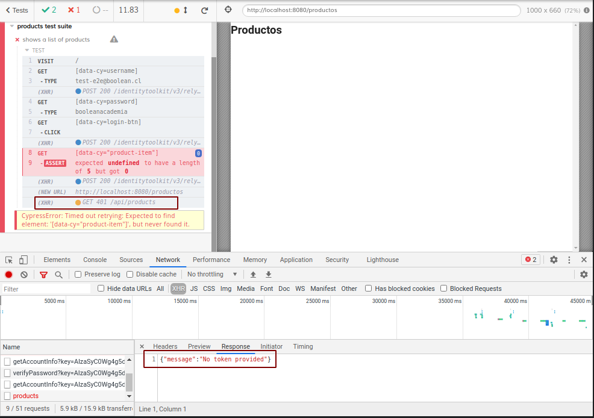

# Validar autenticación en el Backend

Firebase hace muy simple la comprobación de tokens de autorización en el Backend. En resumen, debemos enviar una cabecera específica desde el Frontend y con la librería de Firebase integrada a nuestro backend podremos validar que las solicitudes sean de un usuario autenticado.
 
Esto llevará consigo una seríe de consideraciones relacionadas al manejo de variables de entorno.

El primer paso de esta etapa es la instalación de la librería `firebase-admin` en nuestro backend. Como ejercicio de estudio, es bueno tener corriendo las pruebas de front y relacionar los distintos códigos de error con el estado del servidor siguiente.

Ejecutamos las pruebas e2e sin encender el servidor y veremos que la solicitud GET a `/api/products` retorna error 500.

Ahora, en una terminal paralela ingresamos a la carpeta backend e ingresamos la siguiente instrucción:

```bash
npm i firebase-admin
```
En esta parte podemos encender el servidor con `npm start`. Al recargar Cypress veremos que todas pruebas vuelven a pasar, pero aún no verificamos nada en el servidor. Para esto reemplaza el contenido del archivo `backend/src/server.js` con lo siguiente:

```javascript
const express = require("express")
const admin = require('firebase-admin')
const app = express()
const port = 3000

admin.initializeApp({credential: admin.credential.applicationDefault()})

app.use('/api', (request,response) => {
  const headerToken = request.headers.authorization;
  if (!headerToken) {
    return response.status(401).json({ message: "No token provided" })
  }
  
  const [authorizationType, tokenValue] = headerToken.split(" ")

  if (headerToken && authorizationType.toLowerCase() !== "bearer") {
    return response.status(401).json({ message: "Invalid token" })
  }
  admin
    .auth()
    .verifyIdToken(tokenValue)
    .then(() => next())
    .catch((error) => {
      console.error(error.message)
      response.status(403).json({ message: "Could not authorize" })
    })
})

app.use('/api/products', (request, response) => {
  const statusCode = 200
  const products = [
    {
      id: 1,
      name: 'Epiphone Explorer Gothic ',
      description: 'Guitarra color negro',
      image: 'https://images.unsplash.com/photo-1550985616-10810253b84d?ixlib=rb-1.2.1&ixid=MXwxMjA3fDB8MHxwaG90by1wYWdlfHx8fGVufDB8fHw%3D&auto=format&fit=crop&w=742&q=80',
      code: '0001'
    },
    {
      id: 2,
      name: 'Cordoba Mini Bass',
      description: 'Bajo pequeño tipo ukelele. Excelente sonido de bajo.',
      image: 'https://images.unsplash.com/photo-1556449895-a33c9dba33dd?ixid=MXwxMjA3fDB8MHxwaG90by1wYWdlfHx8fGVufDB8fHw%3D&ixlib=rb-1.2.1&auto=format&fit=crop&w=2734&q=80',
      code: '0002'
    },
    {
      id: 3,
      name: 'Distorsión Custom Badass 78',
      description: 'Peda del guitarra de distorsión.',
      image: 'https://images.unsplash.com/photo-1527865118650-b28bc059d09a?ixlib=rb-1.2.1&ixid=MXwxMjA3fDB8MHxwaG90by1wYWdlfHx8fGVufDB8fHw%3D&auto=format&fit=crop&w=668&q=80',
      code: '0003'
    },
    {
      id: 4,
      name: 'Distorsión TMiranda Bass Drive BD-1',
      description: 'Pedal del bajo de distorsión.',
      image: 'https://images.unsplash.com/photo-1614963590047-0b8b9daa3eb7?ixid=MXwxMjA3fDB8MHxwaG90by1wYWdlfHx8fGVufDB8fHw%3D&ixlib=rb-1.2.1&auto=format&fit=crop&w=2089&q=80',
      code: '0004'
    },
    {
      id: 5,
      name: 'Looper Hotone Wally',
      description: 'Pedal de looper. Super portable.',
      image: 'https://images.unsplash.com/photo-1595167151695-dfb4846e70f8?ixid=MXwxMjA3fDB8MHxwaG90by1wYWdlfHx8fGVufDB8fHw%3D&ixlib=rb-1.2.1&auto=format&fit=crop&w=668&q=80',
      code: '0005'
    }
  ]
  
  console.log(`GET with status code ${statusCode} in /api/products endpoint`);
  
  return response
    .status(statusCode)
    .json(products)
})

app.listen(port, () => {
  console.log(`App server listening on port ${port}`);
})


```
Si quieres conocer el detalle de cómo integrar firebase al servidor, revisa la siguiente [documentación](https://firebase.google.com/docs/admin/setup#add-sdk)

Con esto, al recargar las pruebas veremos que el error pasó de 500 a 401, es decir, el servidor está revisando que las solicitudes tengan la cabecera de autorización y cómo no hemos configurado eso en el Frontend la aplicación entrega el mensaje y códigos especificados en la primera sentencia `if`. TIP: En Cypress puedes acceder a las herramientas para desarrolladores al igual que en cualquier navegador moderno. Haciendo esto nuestras pruebas se ven como en la siguiente imagen:



Lo mínimo para volver a pasar las pruebas sería agregar la cabecera correspondiente en el Frontend. Esto lo logramos reemplazamos el archivo `frontend/src/store/index.js` con el siguiente contenido:

```javascript
import Vue from 'vue'
import Vuex from 'vuex'
import axios from 'axios'
import { Auth } from '@/firebase'

Vue.use(Vuex)

export default new Vuex.Store({
  state: {
    products: []
  },
  mutations: {
    SET_PRODUCTS (store, products) {
      store.products = products
    }
  },
  actions: {
    async getProducts (actionContext) {
      const { commit } = actionContext
      const productsURL = '/api/products'

      try {
        const token = await Auth.currentUser?.getIdToken(true)
        const response = await axios.get(productsURL, { headers: { Authorization: `Bearer ${token}` } })
        commit('SET_PRODUCTS', response.data)
      } catch (error) {
        console.log(error)
      }
    }
  },
  modules: {
  }
})

```

Con esto en su lugar, recargamos Cypress y la terminal de Express indicará el siguiente mensaje de error:


  2 Descargar el `firebase-service-account.json` en la carpeta /backend con el nombre específico, agregarlo al gitignore
  3 Configurar nodemon agregando dos variables de ambiente `NODE_ENV` y `GOOGLE_APPLICATION_CREDENTIALS`

  nodemon.json

  ```json
    {
      "env": {
        "NODE_ENV": "development",
        "GOOGLE_APPLICATION_CREDENTIALS": "ruta-absoluta-de-tu-proyecto/backend/src/firebase-service-account.json",
        "PORT": 3000
      }
    }
  ```

  Configurar las rutas con el middleware
  Test vuelve a fallar (403)
  Agregar los interceptores de axios para las cabeceras (200)