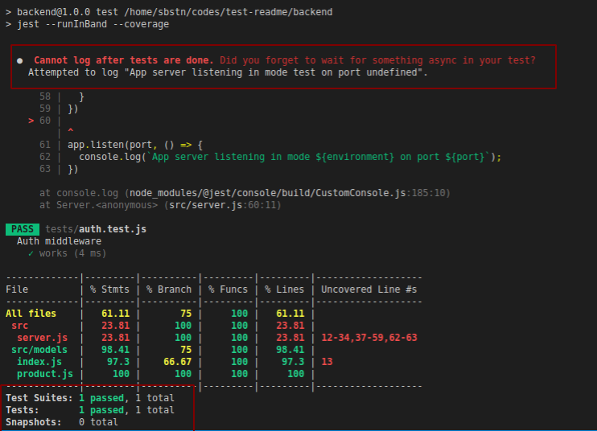
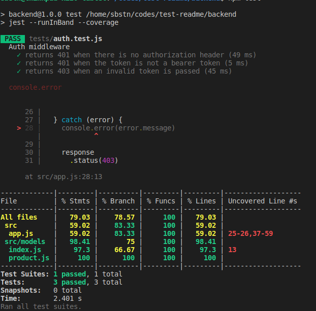
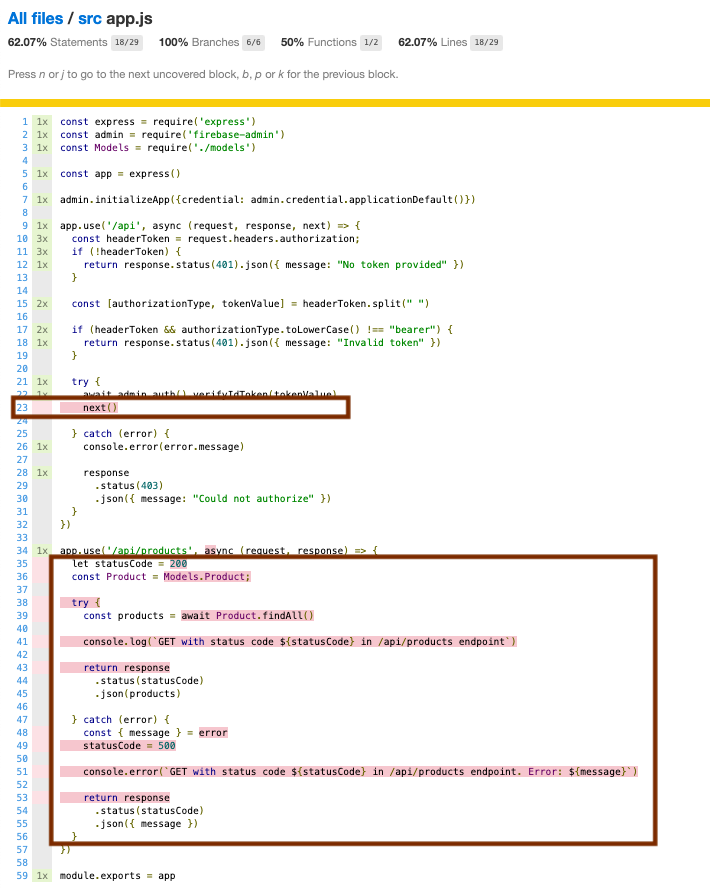
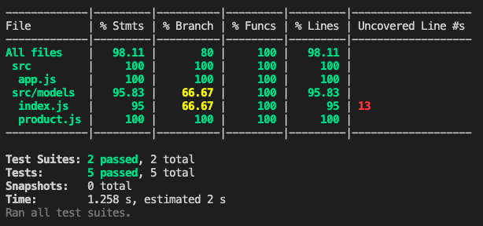
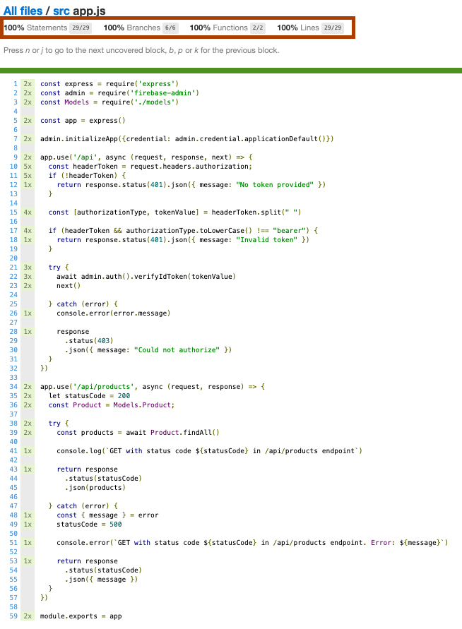
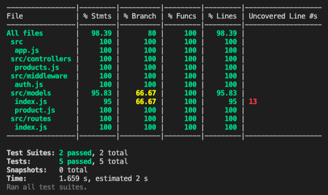

# Refactorización utilizando pruebas de software en Backend
En este punto la funcionalidad ya está completa, pero la organización del código se puede mejorar para aumentar su flexibilidad a los cambios que inevitablemente llegarán.

Para esto necesitamos una forma de asegurar que no romperemos nada de lo que hemos logrado. La funcionalidad se debe mantener, pero la calidad del código debe aumentar. Para esto agregaremos pruebas de software para el código tanto en el Backend como en el Frontend.

### Pruebas de software en Backend

Utilizaremos tres herramientas populares de Javascript para escribir y ejecutar pruebas: `jest`, `jest-cli` y `supertest`. Primero navegamos a la carpeta `/backend` y luego ejecutamos el siguiente comando: 

```bash
npm i jest jest-cli supertest --save-dev
```
Al igual que como lo hicimos con Sequelize-cli, vamos a exponer el comando de Jest para no tener que instalarlo globalmente. Eso es en el archivo `backend/package.json`. También vamos a cambiar el comando de test que viene por defecto. El archivo quedaría de la siguiente forma:

```javascript
 ...
  "scripts": {
    "start": "nodemon src/server.js",
    "test": "jest --runInBand --coverage",
    "jest": "jest",
    "sequelize": "sequelize"
  },
...
```
Jest tiene el comando --init para configurar el entorno de pruebas. El comando a ejecutar es el siguiente:
 `npm run jest -- --init`
Esto nos hará una pequeña serie de preguntas que debemos responder con lo siguiente:


Ahora continuaremos configurando una base de datos exclusivamente para la ejecución de pruebas. Para esto modificamos el archivo `backend/src/config/config.json`
en la sección "test".

```javascript
"test": {
  "username": "root",
  ...
  "host": "test.database.sqlite3",
  "dialect": "sqlite",
  "logging": false
},
```
Durante la ejecución de las pruebas se creará una nueva bases de datos que no necesitamos incluir en el repositorio, por lo que agregaremos el nombre  de la base de datos de prueba `test.database.sqlite3` al `.gitignore`.

Para probar el backend vamos a crear la carpeta `/tests` dentro del directorio `backend` y crearemos una prueba simple para revisar que esté todo bien configurado. A este archivo lo llamaremos `auth.test.js` ya que es la primera funcionalidad de describimos de nuestro servidor. Su contenido es el siguiente:

```javascript
const server = require('../src/server')

describe('Auth middleware',() => {
  it('works', () => {
    expect(true).toEqual(true)
  })
})

```

Esto lo ejecutamos con el comando que configuramos `npm test`. La salida en la terminal de esta ejecución es la siguiente:



Tenemos resultados confusos, ya que en concreto la prueba si pasa, pero vemos una indicación en rojo de que estamos ejecutando `console.log` una vez terminada la prueba. En este caso es Express en la llamada `app.listen` que hace correr un proceso en forma indefinida y jest queda ejecutándose. Entonces debemos separar lo que vamos a probar (la lógica) de lo que ejecuta el servidor (`listen`).

Logramos esto separando el archivo `server.js` para que quede de la siguiente forma: 

```javascript
const app = require('./app')
const port = process.env.PORT
const environment = process.env.NODE_ENV

app.listen(port, () => {
  console.log(`App server listening in mode ${environment} on port ${port}`)
})

```
El resto del contenido lo agregaremos aun archivo llamado `app.js` también en la raíz de Backend con lo siguiente:


```javascript
const express = require('express')
const admin = require('firebase-admin')
const Models = require('./models')

const app = express()

admin.initializeApp({credential: admin.credential.applicationDefault()})

app.use('/api', async (request, response, next) => {
  const headerToken = request.headers.authorization
  if (!headerToken) {
    return response.status(401).json({ message: 'No token provided' })
  }

  const [authorizationType, tokenValue] = headerToken.split(' ')

  if (headerToken && authorizationType.toLowerCase() !== 'bearer') {
    return response.status(401).json({ message: 'Invalid token' })
  }

  try {
    await admin.auth().verifyIdToken(tokenValue)
    next()

  } catch (error) {
    console.error(error.message)

    response
      .status(403)
      .json({ message: 'Could not authorize' })
  }
})

app.use('/api/products', async (request, response) => {
  let statusCode = 200
  const Product = Models.Product;
  
  try {
    const products = await Product.findAll()

    console.log(`GET with status code ${statusCode} in /api/products endpoint`)

    return response
      .status(statusCode)
      .json(products)

  } catch (error) {
    const { message } = error
    statusCode = 500

    console.error(`GET with status code ${statusCode} in /api/products endpoint. Error: ${message}`)
    
    return response
      .status(statusCode)
      .json({ message })
  }
})

module.exports = app

```
Y modificamos la prueba para requerir el archivo `app.js`:

```javascript
const app = require('../src/app')

describe('Auth middleware',() => {
  it('works', () => {
    expect(true).toEqual(true)
  })
})

```
Con estos ajustes la salida de las pruebas queda como indica la siguiente imagen:


#### Casos de la funcionalidad para definir pruebas

En este momento el servidor tiene las siguientes características:

- Valida que las solicitudes a `/api` estén autenticadas con 4 casos posibles. 3 casos en los cuales respondemos un código de error y uno en el cuál resulta exitoso y se deja pasar la solicitud.

**backend/src/server.js**
```javascript
app.use('/api', async (request, response, next) => {
  if (!headerToken) {
    // Caso 1 error: no se envía la cabecera "Authorization"
  }
  if (headerToken && authorizationType.toLowerCase() !== "bearer") {
    // Caso 2 error: se envía una cabecera "Authorization" que no es del tipo "Bearer"
  }
  try {
    // Caso 3 éxito: La solicitud fue validada exitosamente
    // y la solicitud ingresa al servidor ejecutando la función "next"
  } catch (error) {
    // Caso 4 error: La librería "firebase-admin" no valida el token enviado
  }
})
```

- Las solicitudes ya autenticadas que consultan `/api/products` pueden tener 2 casos posibles al hacer consultas a la base de datos.

**backend/src/server.js**
```javascript
app.use('/api/products', async (request, response) => {
  try {
    // Caso 1 exito: Se consulta la base de datos exitosamente 
  } catch (error) {
    // Caso 2 exito: Ocurre un error al consultar la base de datos
  }
})
```
Estas son las funcionalidades que debemos mantener y que deben resistir el proceso de refactorización.

Es una buena práctica primero previsualizar los casos a los cuales vamos a escribir las pruebas así tenemos claro que código está involucrado en cada uno de los casos y será más fácil escribir la implementación de la prueba.

#### Implementación de pruebas sobre el Middleware de validación de solicitudes autorizadas

Vamos a escribir las pruebas que definimos para los casos que describimos anteriormente.

##### Caso 1 error: no se envía la cabecera "Authorization"

Resultado esperado
```
Retorna 401 y un mensaje "No token provided" cuando no viene la cabecera de autorización
```
Vamos a escribir el código para representar este caso como indica el siguiente código:

**backend/tests/auth.test.js**
```javascript
const supertest = require('supertest')
const app = require('../src/app')

describe('Auth middleware',() => {
  it("returns 401 when there is no authorization header", async () => {
    const response = await supertest(app)
      .get('/api/any-endpoint')
      .expect(401)
    expect(response.body).toMatchObject({ message: "No token provided" })
  })
})
```
Podemos notar como a partir de la librería `Supertest` podemos simular una solicitud al servidor sin necesidad de crear una real pasándole el módulo de express que en nuestro caso se exporta a través del valor `app`. Esto permite a `Supertest` conocer la configuración de las rutas que hemos definido para nuestros endpoints y hacer la simulación. 

En adelante vamos a complementar este archivo agregando los bloques `it` dentro del bloque `describe` en el mismo orden que hicimos nuestro análisis

##### Caso 2 error: se envía una cabecera "Authorization" que no es del tipo "Bearer"
Resultado esperado
```
Retorna 401 y un mensaje "Invalid token" cuando el token no es de tipo Bearer
```

El código que representa este caso es como indica el siguiente código:

```javascript
it('returns 401 when the token is not a bearer token', async ()=>{
  const response = await supertest(app)
    .get('/api/fake')
    .set('Authorization','Token faketoken')
    .expect(401)
  expect(response.body).toMatchObject({ message: 'Invalid token' })
})
```

##### Caso 3 éxito: La solicitud fue validada exitosamente y la solicitud ingresa al servidor ejecutando la función "next"

Resultado esperado
```
Al validar el token deja pasar la petición ejecutando la función "next"
```

Este caso no lo implementaremos debido a que cuando escribamos los casos para el endpoint `GET /api/products` estaremos pasando por este middleware y será implícito que las pruebas ejecuten este caso para poder ejecutar la lógica definida para esto.


##### Caso 4 error: La librería "firebase-admin" no valida el token enviado

Resultado esperado
```
Retorna 403 y un mensaje "Could not authorize" cuando el token es de tipo Bearer, pero no es válido
```

En este caso debemos crear un mock de la librería `firebase-admin` para simular que el llamado al método `verifyIdToken` tome el comportamiento que necesitemos para la prueba. 
Primero modificaremos las funciones que utilizamos de `firebase-admin` para que la prueba se ejecute sin errores:

```javascript
const supertest = require('supertest')
const app = require('../src/app')
const admin = require('firebase-admin');

jest.mock('firebase-admin', () => ({
  auth: jest.fn()
    .mockReturnValue({ verifyIdToken: jest.fn() }),
  credential: {
    applicationDefault: jest.fn(),
  },
  initializeApp: jest.fn()
}))
...
```

Ahora sí podemos agregar el último `it` en el que forzaremos un rechazo de la promesa en la función `verifyIdToken`, para simular que se entregó un token inválido.

```javascript

it('returns 403 when an invalid token is passed',async () => {
    admin.auth().verifyIdToken.mockRejectedValue(new Error())
    const response = await supertest(app)
      .get('/api/fake')
      .set('Authorization', 'Bearer faketoken')
      .expect(403)
    expect(response.body).toMatchObject({ message: 'Could not authorize' })

  })
```
En la ultima prueba jest incluso nos muestra el `console.error` que se debe ejecutar en el código de la aplicación cuando llega un token inválido. Lo puedes ver en el siguiente screenshot:




Con todo lo anterior el código completo del archivo `auth.test.js` queda de la siguiente forma:

**backend/tests/auth.test.js**
```javascript
const supertest = require('supertest')
const app = require('../src/app')
const admin = require('firebase-admin')

jest.mock('firebase-admin', () => ({
  auth: jest.fn().mockReturnValue({ verifyIdToken: jest.fn() }),
  credential: {
  applicationDefault: jest.fn(),
  },
  initializeApp: jest.fn()
}))

describe('Auth middleware',() => {
  it('returns 401 when there is no authorization header', async () => {
    const response = await supertest(app)
      .get('/api/fake')
      .expect(401)
    expect(response.body).toMatchObject({ message: 'No token provided' })
  })
  it('returns 401 when the token is not a bearer token', async ()=>{
    const response = await supertest(app)
      .get('/api/fake')
      .set('Authorization','Token faketoken')
      .expect(401)
    expect(response.body).toMatchObject({ message: 'Invalid token' })
  })

  it('returns 403 when an invalid token is passed',async () => {
    admin.auth().verifyIdToken.mockRejectedValue(new Error());
    const response = await supertest(app)
      .get('/api/fake')
      .set('Authorization', 'Bearer faketoken')
      .expect(403)
    expect(response.body).toMatchObject({ message: 'Could not authorize' })
  })
})

```

Antes de continuar vamos a echar un vistazo a una nueva carpeta que se ha creado en la raíz del directorio `backend` llamada `coverage`. En su interior veremos otro directorio llamado `lcov-report` y en su interior un archivo `index.html`
Si nevagamos hasta este archivo a través del sistema de archivos de nuestro sistema operativo y lo abrimos con un navegador web veremos algo como lo siguiente:


Luego si hacemos click en `src` y luego en `app.js` veremos lo que muestra la siguiente imagen:



Podemos ver claramente como es que el informe de cobertura nos muestra que aún no hemos escrito pruebas que ejecuten los códigos remarcados en la imagen.

⚠️ Ahora vamos a agregar al archivo `.gitignore` el directorio `coverage` porque es importante que este informe sea regenerado por cada ejecución de las pruebas.


Seguimos adelante con las pruebas cuando la solicitud pasa el middleware de autorización y solicita el listado de productos.

#### Implementación de pruebas para endpoints que hacen consultas a una base de datos

Vamos a escribir las pruebas que definimos para los casos que describimos anteriormente para las funcionalidad de responder al endpoint `GET /api/products`:

##### Caso 1 exito: Se consulta la base de datos exitosamente 

Resultado esperado
```
Retorna 200 y una lista de productos que previamente fueron insertados en la base de datos
```

Haremos un nuevo archivo dentro del directorio `backend/tests` llamado `products.test.js`. 

Este es un caso más complejo, porque debemos simular (usando dobles de prueba) que la solicitud cumple con los requisitos de autorización, de otra forma nuestro código no se ejecutará. Además necesitamos probar que la aplicación entrega el arreglo de productos definido en los Fixtures, por lo que hay agregar estos datos a la BDD antes de enviar la solicitud. 
Esto lo podemos lograr con las funciones `beforeAll` y `afterAll` que se ejecutarán al inicio y al final de todas las pruebas respectivamente con el objetivo de sincronizar la base de datos y correr las migraciones a través de `Models.sequelize.sync`.

La prueba queda de la siguiente forma:

**backend/tests/products.test.js**
```javascript
const supertest = require('supertest')
const admin = require('firebase-admin')
const app = require('../src/app')
const Models = require('../src/models')
const productsFixture = require('../../fixtures/products.json')

jest.mock('firebase-admin', () => ({
  auth: jest.fn().mockReturnValue({ verifyIdToken: jest.fn() }),
  credential: {
    applicationDefault: jest.fn(),
  },
  initializeApp: jest.fn()
}))

describe('/api/products', () =>{

  beforeAll(async () => {
    await Models.sequelize.sync({ force: true })
    admin.auth().verifyIdToken.mockResolvedValue(true)
  })

  it('returns an array of products', async () => {
    await Models.Product.bulkCreate(productsFixture)
    
    const response = await supertest(app)
      .get('/api/products')
      .set('Authorization', 'Bearer valid-token')
      .expect(200)
    expect(response.body).toMatchObject(productsFixture)
  })

  afterAll(async () => {
    await Models.sequelize.close()
  })
})

```

Lo que hicimos en esta prueba fue antes de ejecutar la solicitud al endpoiint

##### Caso 2 exito: Ocurre un error al consultar la base de datos

Resultado esperado
```
Retorna 500 y un mensaje con el error que sucedión en la base de datos
```

Para hacer que la base de datos falle, lo que haremos será destruir la table `Products` a través de Sequelize utilizando el método `drop`.
Agregaremos el siguiente bloque `it` bajo del que ya escribimos en el archivo `backend/tests/products.test.js`

**backend/tests/auth.test.js**
```javascript
it('returns 500 when the database throws error', async () => {
    await Models.Product.drop()

    const response = await supertest(app)
      .get('/api/products')
      .set('Authorization', 'Bearer valid-token')
      .expect(500)
    expect(response.body).toMatchObject({ message: 'SQLITE_ERROR: no such table: Products' })
  })
```

al correr el comando `npm test` deberiamos ver todas las pruebas pasando como muestra la siguiente imagen:



Podemos validar que ahora estamos cubriendo toda la funcionalidad construida hasta el momento con nuestras pruebas revisando tal como lo hicimos anteriormente en el archivo en el directorio `coverage`.



Ahora con toda nuestra funcionalidad cubierta con las pruebas pasando, volvemos a refactorizar para dividir los controladores, middleware y rutas siguiendo los guías SOLID.

Vamos a re-estructurar el proyecto para que quede de la siguiente forma

```bash
<backend>
├── coverage
├── node_modules
├── src
    ├── config
    ├── controllers <-- directorio nuevo y archivo
        products.js
    ├── middleware <-- directorio nuevo y archivo
        auth.js
    ├── migrations
    ├── models
    ├── routes <-- directorio nuevo y archivo
        index.js
    ├── seeders
    app.js
    server.js
├── tests
    auth.test.js
    products.test.js
.sequelizesrc
firebase-service-account.json
jest.config.js
local.database.sqlite3
nodemon.json
package-lock.json
package.json
test.database.sqlite3
```
Ahora vamos a mostrar el contenido de 4 archivos involucrados en la refactorización

**backend/controllers/products.js**

```javascript
const Models = require('../models');
const Product = Models.Product;

module.exports = {
  async index(request, response) {
    let statusCode = 200

    try {
      const products = await Product.findAll()
  
      console.log(`GET with status code ${statusCode} in /api/products endpoint`)
  
      return response
        .status(statusCode)
        .json(products)
  
    } catch (error) {
      const { message } = error
      statusCode = 500
  
      console.error(`GET with status code ${statusCode} in /api/products endpoint. Error: ${message}`)
      
      return response
        .status(statusCode)
        .json({ message })
    }
  }
}

```

**backend/middleware/auth.js**

```javascript
const admin = require('firebase-admin')

admin.initializeApp({ credential: admin.credential.applicationDefault() })

module.exports = async (request, response, next) => {
  const headerToken = request.headers.authorization;
  if (!headerToken) {
    return response.status(401).json({ message: 'No token provided' })
  }

  const [authorizationType, tokenValue] = headerToken.split(' ')

  if (headerToken && authorizationType.toLowerCase() !== 'bearer') {
    return response.status(401).json({ message: 'Invalid token' })
  }

  try {
    await admin.auth().verifyIdToken(tokenValue)
    next()

  } catch (error) {
    console.error(error.message)

    response
      .status(403)
      .json({ message: 'Could not authorize' })
  }
}

```

**backend/routes/index.js**

```javascript
const express = require('express');
const router = express.Router();
const productsController = require('../controllers/products')

router.get('/products', productsController.index);

module.exports = router

```

**backend/app.js**

```javascript
const express = require('express')
const authMiddleware = require('./middleware/auth')
const routes = require('./routes')

const app = express()

app.use('/api', authMiddleware)
app.use('/api', routes)

module.exports = app

```

finalmente al volver a correr el comando `npm test` veremos que el informe de cobertura nos muestra la nueva distribución de los archivos que fueron ejecutados en las pruebas.



De esta manera logramos hacer una refactorización para ordenar y preparar al código del servidor para ser más escalable para los futuros incrementos del código.

Momento de un nuevo commit. Escribimos lo siguiente en la terminal:

```bash
git add .
git commit -m "refactor(backend-refactor): Se agregó set de pruebas de caracterización en el Backend y luego un refactor para dividir responsabilidades"
```

<table>
  <tr>
    <th colspan="2">
      <a href="./05-database-sequelize.md">
        <span>⬅️ </span>
       Agregando base de datos en desarrollo
      </a>
    </th>
    <th colspan="2">
      <a href="./07-testing-frontend.md">Pruebas de software para Frontend
        <span>➡️ </span>
      </a>
    </th>
  </tr>
</table>


https://vue-test-utils.vuejs.org/guides/testing-async-components.html#asynchronous-behavior-outside-of-vue