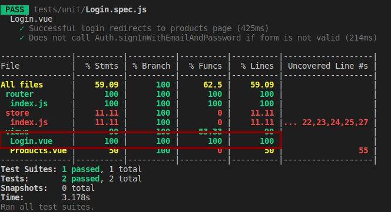
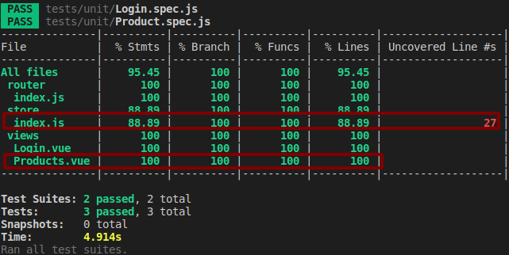
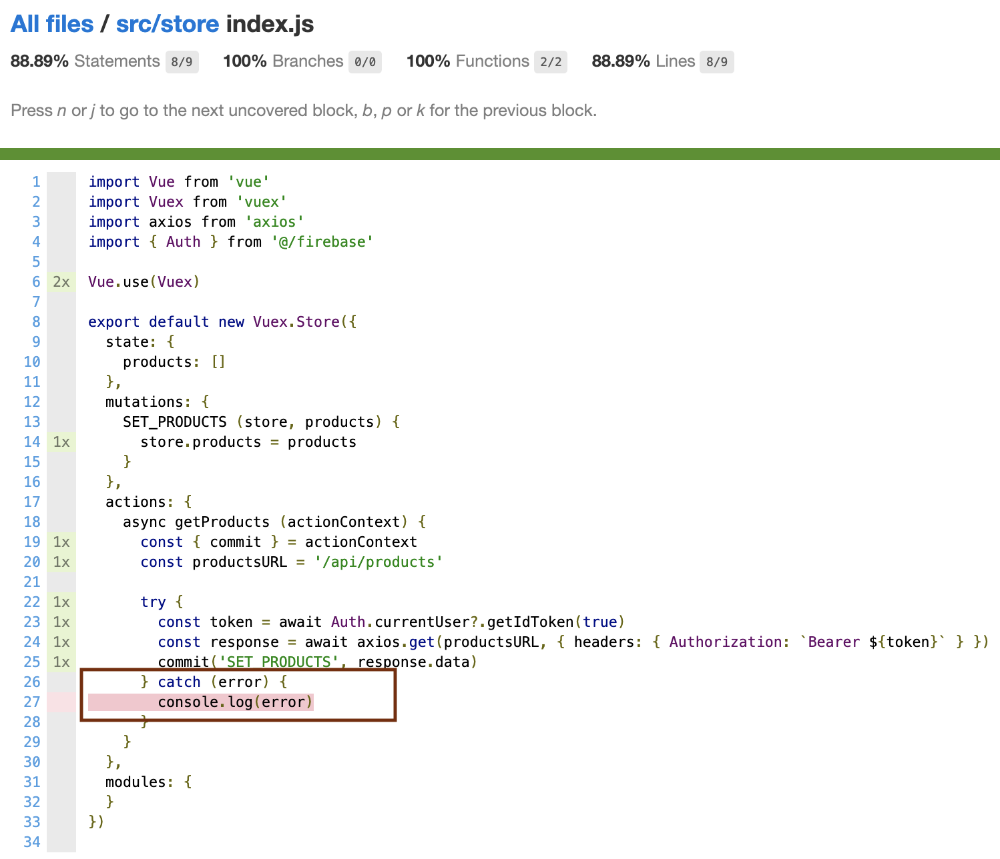
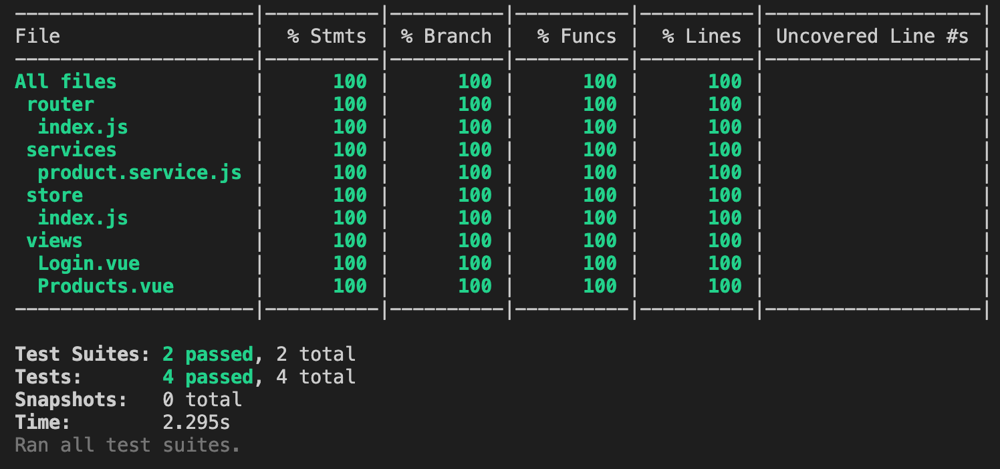
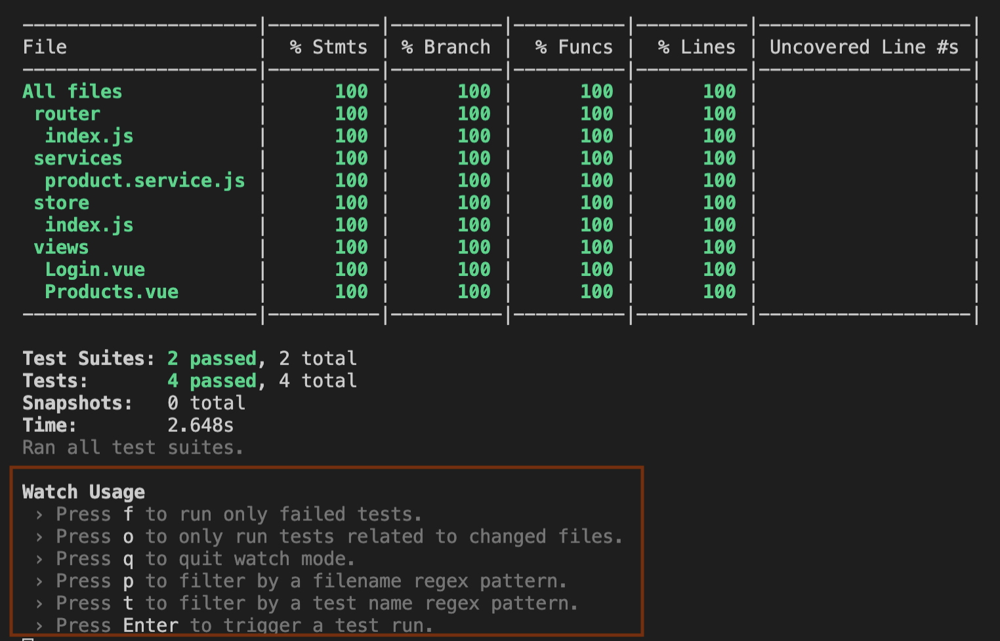
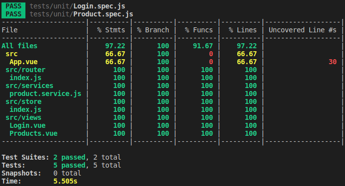

# Refactorización utilizando pruebas de software en el Frontend

Ahora continuaremos caracterizando el Frontend con pruebas para luego refactorizar con confianza, además crearemos una nueva funcionalidad siguiendo la metodología TDD en base a un nuevo requerimiento. 

> **Tip** 
La refactorización con pruebas es una de las mejores formas para trabajar con código heredado/legacy que se debe mantener y actualizar

A diferencia de las pruebas del Backend, nuestro Frontend utiliza VueJS y plugins como Vuex y Vuetify. Esto agrega más dificultad al momento de escribir pruebas, porque debemos simular en cada prueba una aplicación Vue similar a la real funcionando con todos los plugins configurados.

Para facilitar las cosas Vue ya trae integrada una biblioteca llamada `@vue/test-utils` que nos permitirá hacer algunas cosas necesarias para ejecutar las pruebas. [En sus guías](https://vue-test-utils.vuejs.org/guides/) hay excelente información para trabajar con Vue-Router y Vuex.

La diferencia es que además tenemos Vuetify en todas las vistas de nuestra aplicación. Y necesita de una configuración especial para integrase en el entorno de pruebas. El detalle y varios ejemplos de como hacer esto lo puedes revisar en la [sección dedicada a pruebas de software de la documentación de Vuetify](https://vuetifyjs.com/en/getting-started/unit-testing/)

En resumen debemos configurar las pruebas para que se incluya globalmente Vuetify en cada prueba. Tenemos que hacer esto en dos pasos. El primero es modificar el archivo `frontend/jest.config.js` con lo siguiente:

```javascript 
module.exports = {
  preset: '@vue/cli-plugin-unit-jest',
  setupFilesAfterEnv: [
    './jest.setup.js'
  ]
}

```
Y a continuación creamos el archivo `jest.setup.js` en la raíz del directorio `frontend` con el siguiente contenido.
Y a continuación creamos el archivo `jest.setup.js` en la raíz del directorio `frontend` con el siguiente contenido.

```javascript 
import Vue from 'vue' 
import Vuetify from 'vuetify'

Vue.use(Vuetify)

```

 Aprovecharemos de incluir la opción para el informe de covertura modificando el archivo `package.json` en su sección `scripts`:

```javascript
"test:unit": "vue-cli-service test:unit --coverage"
```

Con esta configuración podemos comenzar a escribir las pruebas. 

## Escenarios de la funcionalidad para definir pruebas 

En estos momentos el Frontend cuenta con las siguientes características

- Tiene una vista `Login` con un formulario con Vuetify que llama a la función `login`, la que a su vez ejecuta el método  de autenticación de Firebase. En caso de ser exitoso, se redirige a la página de productos.

El resúmen de ese código lo vemos en la siguiente imagen.
**f rontend/views/Login.vue**

```javascript
...

async login () {
  if (this.validate()) {
    // Caso 1: Formulario válido y autenticación exitosa, entonces ir a la página de productos
    await Auth.signInWithEmailAndPassword(this.email, this.password)
    this.$router.push({ name: 'Products' })
  }
  // Caso 2: Para un formulario inválido NO llamamos al método de autenticación
}
```

- También tenemos una vista llamada `Products` que al montarse en el DOM, ejecuta una acción de *Vuex* para guardar en la variable `products` la lista de productos provenientes del servidor. Cuando esta variable se actualiza, nuestra vista reacciona a esto mostrando la lista de elementos.

Lo vemos en el siguiente resumen
**frontend/src/views/Products.vue**
```javascript
...
computed: {
  ...mapState(['products'])
},
methods: {
  ...mapActions(['getProducts'])},
created () {
  // Delegación al store
  this.getProducts()
}
...
```

**frontend/src/store/index.js**
```javascript
actions: {
  async getProducts (actionContext) {
    const { commit } = actionContext
    const productsURL = '/api/products'

    try {
    // Caso 1: Se crea la lista de productos si el servidor responde exitosamente al ejecutar getProducts 
    } catch (error) {
    // Caso 2: Al invocar a la acción getProducts al inicio de la vista NO se crea la lista de productos si el servidor responde con error
    }
  },
  ...
```

## Pruebas sobre la vista Login

Vamos a escribir las pruebas para los casos que describimos anteriormente.

### Caso 1: Formulario válido y autenticación exitosa, entonces ir a la página de productos

Resultado esperado

```
Al resolverse la promesa del método Auth.signInWithEmailAndPassword llama al método $router.push 
```

La implementación de estas pruebas las escribiremos en un nuevo archivo llamado `Login.spec.js` en la carpeta `frontend/tests/unit` con el siguiente contenido:


**frontend/tests/unit/Login.spec.js**
```javascript

import { mount, createLocalVue } from '@vue/test-utils'
import Vuetify from 'vuetify'
import flushPromises from 'flush-promises'

import App from '@/App.vue'
import store from '@/store'
import router from '@/router'
import { Auth } from '@/firebase'

jest.mock('@/firebase',()=> ({
  Auth: {
    signInWithEmailAndPassword: jest.fn()
  }
}))

describe('Login.vue', () => {
  let localVue, vuetify

  beforeEach(() => {
    localVue = createLocalVue()
    vuetify = new Vuetify()

    Auth.signInWithEmailAndPassword.mockReset()
    router.push('/')
  })

  it('Successful login ruby to products page', async () => {
    Auth.signInWithEmailAndPassword.mockResolvedValue()
    const wrapper = mount(App,{
      localVue,
      vuetify,
      store,
      router
    })
    wrapper.vm.$router.push = jest.fn()
    wrapper.find('[data-cy=username]').setValue('testlogin@boolean.cl')
    wrapper.find('[data-cy=password]').setValue('somepass')

    wrapper.find('[data-cy=login-btn]').trigger('click')
    await flushPromises()

    expect(wrapper.vm.$router.push).toHaveBeenCalledWith({ name: 'Products' })
  })
})

```

Vemos que incluimos un bloque `beforeEach` que nos permitirá hacer algunas acciones comunes relativas a las pruebas que escribiremos como por ejemplo dobles de prueba para la autenticación y su correspondiente `mockReset` para así asegurarnos de cumplir el [principio FIRST](http://agileinaflash.blogspot.com/2009/02/first.html) manteniendo a cada una de las pruebas "aisladas" entre si.         
Aprovechando que nuestras vistas están integradas con el enrutador de la aplicación, realizamos una navegación hacia la ruta `/` para asegurarnos que cuando la aplicación sea montada para las pruebas, se utilice la vista correcta.

Elimina el `example.spec.js` que se creo junto con la aplicación. No lo usaremos.

Al analizar la prueba vemos como podemos manipular la promesa que retorna el método `Auth.signInWithEmailAndPassword` y que resuelva con ayuda de Jest en la función `mockResolvedValue`. Como esta promesa se resuelve en el contexto de la aplicación Vue (de forma asíncrona) esta no se resolverá instantáneamente. Para l ograr que resuelva durante la ejecución de la prueba utilizaremos la biblioteca `flush-promises`. Podemos ver una explicación desde la propia documentación de Vue relacionada a esto en [este enlace](https://vue-test-utils.vuejs.org/guides/testing-async-components.html#asynchronous-behavior-outside-of-vue)


Vamos a instalar esta biblioteca ejecutando lo siguiente en nuestra terminal preocupándonos de navagar hasta el directorio `frontend` en nuestro proyecto:

```bash
npm i  flush-promises --save-dev
```

Ahora ya estamos en condiciones de correr las pruebas que escribimos para la vista `Login.vue`. Al correr el comando `npm run test:unit` veremos lo siguiente:


Como vemos remarcado en la imagen aún no hemos abordado todos los casos para esta vista. Si vamos a la carpeta coverage que se debe haber creado en la raíz del directorio `frontend` y analizamos el archivo `frontend/src/Login.vue` veremos lo siguiente:


Esto quiere decir que necesitamos una prueba que cubra el caso en el cual se llama a la función `login` pero el formulario no es válido.

En adelante vamos a complementar este archivo agregando los bloques `it` dentro del bloque `describe` en el mismo orden que hicimos nuestro análisis

### Caso 2: Para un formulario inválido NO llamamos al método de autenticación

Resultado esperado
```
NO se llama al Auth.signInWithEmailAndPassword
```

la implementación de la prueba sería la siguiente:

```javascript
it('Does not call Auth.signInWithEmailAndPassword if form is not valid', async () => {
  const wrapper = mount(App, {
    vuetify: new Vuetify(),
    store,
    router
  })
  wrapper.find('[data-cy=login-btn]').trigger('click')
  
  expect(Auth.signInWithEmailAndPassword).not.toHaveBeenCalled()
})
```
Ahora al volver a ejecutar las pruebas vemos como ya hemos abarcado el 100% de los casos para esta vista en la siguiente imagen:




Podemos notar que con estas 2 pruebas ya hemos abarcado casi la mitad de lo que hemos construido hasta el momento.
Nuestro enfoque será primero escribir pruebas de "alto nivel" que nos permitan abarcar la mayor cantidad de código posible de forma de tener una base de confianza que corrobore que al refactorizar escribiendo código mejor estructurado, la funcionalidad general de la aplicación se mantenga sin cambios.

El archivo `frontend/tests/unit/Login.spec.js` debería haber quedado de la siguiente forma:
 
```javascript
import { mount, createLocalVue } from '@vue/test-utils'
import Vuetify from 'vuetify'
import flushPromises from 'flush-promises'

import App from '@/App.vue'
import store from '@/store'
import router from '@/router'
import { Auth } from '@/firebase'

jest.mock('@/firebase',()=> ({
  Auth: {
    signInWithEmailAndPassword: jest.fn()
  }
}))

describe('Login.vue', () => {
  let localVue
  let vuetify

  beforeEach(() => {
    localVue = createLocalVue()
    vuetify = new Vuetify()

    router.push('/')
    Auth.signInWithEmailAndPassword.mockReset()
  })

  it('Successful login redirects to products page', async () => {
    Auth.signInWithEmailAndPassword.mockResolvedValue()
    const wrapper = mount(App,{
      localVue,
      vuetify: new Vuetify(),
      store,
      router
    })
    wrapper.vm.$router.push = jest.fn()
    wrapper.find('[data-cy=username]').setValue('testlogin@boolean.cl')
    wrapper.find('[data-cy=password]').setValue('somepass')

    wrapper.find('[data-cy=login-btn]').trigger('click')
    await flushPromises()

    expect(wrapper.vm.$router.push).toHaveBeenCalledWith({ name: 'Products' })
  })

  it('Does not call Auth.signInWithEmailAndPassword if form is not valid', async () => {
    const wrapper = mount(App, {
      vuetify: new Vuetify(),
      store,
      router
    })
    wrapper.find('[data-cy=login-btn]').trigger('click')
    
    expect(Auth.signInWithEmailAndPassword).not.toHaveBeenCalled()
  })
})

```
## Pruebas sobre la vista Products

Pasaremos a hacer las pruebas para productos.

### Caso 1: Se crea la lista de productos si el servidor responde exitosamente al ejecutar getProducts 

Resultado esperado
```
Al resolverse la promesa de axios, la vista agrega los elementos en función de la cantidad de productos que provienen del servidor
```

La implementación de estas pruebas las escribieremos en un nuevo archivo llamado `Products.spec.js` en la carpeta `frontend/tests/unit` con el siguiente contenido:

**frontend/tests/unit/Products.spec.js**
```javascript
import { mount, createLocalVue } from '@vue/test-utils'
import axios from 'axios'
import flushPromises from 'flush-promises'
import Vuetify from 'vuetify'

import App from '@/App.vue'
import store from '@/store'                  
import router from '@/router'
import products from '../../../fixtures/products.json'

jest.mock('axios',() => ({
  get: jest.fn()
}))

jest.mock('@/firebase',() => ({
  Auth: {
    currentUser: { 
      name: 'dummyUser',
      getIdToken: () => 'fakeToken'
    }
  }
}))

describe('Product.vue',() => {
  let localVue
  let vuetify

  beforeEach(() => {
    localVue = createLocalVue()
    vuetify = new Vuetify()

    store.replaceState({
      products: []
    })
    axios.get.mockReset()
    router.push('/')
  })

  it('Shows a list of products when the server response successfully', async () => {
    const wrapper = mount(App,{
      localVue,
      vuetify,
      store,
      router
    })
    axios.get.mockResolvedValue({ data: products })
    
    router.push( { name: 'Products' } )
    await flushPromises()

    expect(wrapper.findAll('[data-cy=product-item]')).toHaveLength(products.length)
    expect(store.state.products).toEqual(products)
  })
})

```

Vemos que la prueba, al igual que en el caso anterior, requiere configuración de dobles de prueba (1 Mock y 1 Stub) y podemos notar como ahora en el bloque `beforeEach` incluimos `store.replaceState`. Esto lo deberemos hacer en cada prueba que tenga atributos del Store para asegurarnos que el estado se reinicia en cada prueba y así estas se mantienen aisladas entre sí.

Otro detalle de la prueba es que la acción de Vuex que  establece el valor de `products` se llama en el método `created` del ciclo de vida del componente, por esto forzaremos este comportamiento navegando hacia la ruta de la página de productos a través del router utilizando `router.push`

Al correr las pruebas veremos lo que muestra la siguiente imagen:



Hemos marcado también el store porque sabemos nuestra vista interactúa con esta sección del código. Si analizamos el archivo de cobertura asociado a este veremos lo siguiente:



Resolveremos esto en el siguiente caso

### Caso 2: Al invocar a la acción getProducts al inicio de la vista NO se crea la lista de productos si el servidor responde con error 

Resultado esperado
```
No se muestran productos en la lista cuando la llamada al servidor responde con error
```

```javascript
it('Shows an empty list of products when the server response failed', async () => {
  const wrapper = mount(App,{
    localVue,
    vuetify,
    store,
    router
  })
  const errorMessage = 'Database Error in Server'
  axios.get.mockRejectedValue(new Error(errorMessage))
  
  router.push( { name: 'Products' } )
  await flushPromises()

  expect(wrapper.findAll('[data-cy=product-item]')).toHaveLength(0)
  expect(store.state.products).toEqual([])
})
```

Ejecutamos las pr uebas y veremos como hemos logrado cubrir todo el código como muestra la siguiente imagen:


## Refactorización del Store

Con esto ya tenemos una capa de cobertura o caracterización que nos permite refactorizar con menos incertidumbre. En el caso del framework Vue con su plugin Vuex es muy frecuente que el `store` sea la primera fuente de *code smells* o signos de complejidad y acoplamiento que pueden dificultar la implementación de cambios posteriores. Una alternativa es extraer la llamada al servidor en un servicio independiente. Para esto creamos el directorio `services` dentro de `src` y ahora crearemos un archivo llamado `product.service.js` con el siguiente contenido:

**frontend/src/services/product.service.js**
```javascript
import axios from 'axios'
import { Auth } from '@/firebase'

const productsURL = 'api/products'

export default {
  async getProducts() {
    try {
      const token = await Auth.currentUser?.getIdToken(true)
      const headers = {
        Authorization: `Bearer ${token}`
      }
      const response = await axios.get(productsURL, { headers })
      return response.data
    } catch (error) {
      throw new Error('Productos momentáneamente no disponibles')
    }
  }
}

```

Y en el `store` quedaría así:

```javascript
import Vue from 'vue'
import Vuex from 'vuex'
import productService from '@/services/product.service'

Vue.use(Vuex)

export default new Vuex.Store({
  state: {
    products: []
  },
  mutations: {
    SET_PRODUCTS (store, products) {
      store.products = products
    }
  },
  actions: {
    async getProducts (actionContext) {
      const { commit } = actionContext
      try {
        const products = await productService.getProducts()
        commit('SET_PRODUCTS', products)
      } catch (error) {
        console.error(error.message)
      }
    }
  }
})

```

Ahora volvemos a ejecutar las pruebas y veremos que siguen pasando y que aún mantenemos la cobertura como muestra la siguiente imagen:




## Nueva funcionalidad siguiendo la metodología TDD

Describiremos el caso hipotético de un requerimiento interno, es decir, que nace del propio equipo de desarrollo. El requerimiento surge de una coordinación entre personas del área de UI (diseño de interfaces), UX (diseño de experiencia), desarrolladores y roles de negocio que termina en manos de los programadores quienes debemos ser capaces de implementar estos requerimientos en la tecnología/framework o lenguaje en que está escrita la aplicación.

**Descripción de alto nivel**

> Crear una alerta centralizada para toda la aplicación que debe mostrar información tanto de éxito como de error manteniendo las guías de diseño actual.

Cuando nos enfrentamos al desafío de implementar requerimientos de alto nivel, debemos refinar la solicitud en términos técnicos usando nuestros conocimiento en programación, Vue y el patrón de manejo de estado implementado con Vuex.

**Descripción técnica**

Lo que haremos será escribir un componente que nos permita mostrar una alerta central que se activará a partir de una propiedad que configuraremos en el store.

Para mostrar la alerta de forma central la agregaremos al componente App.vue que se conectará al estado y mostrará o no la alerta en función de si está la alerta o no asignada. El valor del estado lo llamaremos `alert` y su valor por defecto será `null`.
Para poder asignar una alerta en el estado expondremos una acción llamada setAlert.

En cuanto a la UI utilizaremos el componente `<v-alert>` que trae Vuetify y modelaremos la alerta como un objeto que tenga las propiedades `message` y `type`.

Aún cuando tenemos una estrategia, entendemos los conceptos de arquitectura del framework y podríamos implementar directamente todo esto en la aplicación, no lo haremos. Lo que sí haremos será modificar nuestras pruebas para hacerlas fallar debido a que las haremos interactuar con cosas que aún no están programadas. Luego implementaremos lo mínimo para pasar las pruebas y la funcionalidad quedará implementada.

### Test Driven Development

Lo primero será agregar un nuevo script al archivo `frontend/package.json` en la sección correspondiente de la siguiente forma

```javascript
"tdd": "npm run test:unit -- --watchAll"
```

Ahora ejecutamos el comando `npm run tdd` y veremos algo como en la siguiente imagen:



Vemos que ahora la terminal está esperando que se hagan cambios ya sea en las pruebas o en el código fuente.

### Implementación de la alerta cuando falla la autenticación en  la vista Login

Comenzaremos modificando los archivos de pruebas que ya habíamos escrito. Agregaremos un nuevo bloque `it` a la prueba de la vista Login.

**frontend/tests/unit/Login.spec.js**
```javascript
it('Shows the global alert when authentication fails ', async () => {
  const wrapper = mount(App, {
    localVue,
    vuetify,
    store,
    router
  })
  const errorMessage = 'Invalid user'
  Auth.signInWithEmailAndPassword.mockRejectedValue(new Error(errorMessage))
  wrapper.find('[data-cy=username]').setValue('sebastian@boolean.cl')
  wrapper.find('[data-cy=password]').setValue('academiaboolean')
  
  wrapper.find('[data-cy=login-btn]').trigger('click')
  await flushPromises()

  const expectedMessage = 'Error al hacer autenticación'
  expect(wrapper.find('[role=alert]').text()).toEqual(expectedMessage)


  expect(store.state.alert).toEqual({
    message: expectedMessage,
    type: 'error'
  })
})
```
Al guardar las pruebas veremos un error como muestra la siguiente imagen:


Esto ocurre porque en la vista Login no capturamos las excepciones cuando ocurre un error en la función `Auth.signInWithEmailAndPassword`. Vamos a modificar esta vista en el archivo `frontend/src/views/Login.vue` reemplazando la función `login` por lo siguiente:


```javascript
async login () {
  if (this.validate()) {
    try {
      await Auth.signInWithEmailAndPassword(this.email, this.password)
      this.$router.push({ name: 'Products' })
    } catch (error) {

    }
  }
}
```

Ahora, al recargar las pruebas veremos que el error ha cambiado a lo que muestra la siguiente imagen:


Como vimos en unos de los capítulos anteriores, lo que deberíamos hacer es escribir el código más simple posible que que sea capaz de pasar la prueba y luego refactorizar. En este caso como la prueba está fallando agregaremos en la sección `template` el código más simple posible que logre pasar esta prueba:

**frontend/src/views/Login.vue**
```html
<template>
  <v-main class="home">
    <div role="alert">
      Error al hacer autenticación
    </div>
    <v-card width="400px" class="mx-auto my-auto">
    ...
    </v-card>
  </v-main>
</template>
```
Ahora al recargarse las pruebas vemos que el error ha cambiado:


Y tal como lo hicimos en el caso anterior escribiremos el código más simple posible para pasar esta prueba. esto sería modificar el store en la propiedad `state` con el siguiente código:

**frontend/src/store/index.js**

```javascript
...

export default new Vuex.Store({
  state: {
    products: [],
    alert: {
      message: 'Error al hacer autenticación',
      type: 'error'
    }
  },
  ...

})

```
Con estos ajustes ya tenemos al código mínimo para pasar la prueba, ahora toca refactorizar y dejar la solución como se planifico en el requerimiento técnico

### Refactorización

Ahora haremos algunos cambios para que nuestro código sea diseñado como habíamos descrito en la definición técnica.

Primero vamos a reemplazar completamente la sección `script` para que quede de la siguiente manera:

```html
<script>
import { mapActions } from 'vuex'
import { Auth } from '@/firebase'

export default {
  data () {
    return {
      email: '',
      emailRules: [
        (v) => !!v || 'El correo es requerido',
        (v) => /.+@.+\..+/.test(v) || 'El correo debe tener formato válido'
      ],
      password: '',
      passwordRules: [(v) => !!v || 'La contraseña es requerida'],
      showPassword: false
    }
  },
  methods: {
    ...mapActions(['setAlert']),
    validate () {
      return this.$refs.form.validate()
    },
    async login () {
      if (this.validate()) {
        try {
          await Auth.signInWithEmailAndPassword(this.email, this.password)
          this.$router.push({ name: 'Products' })
        } catch (error) {
          this.setAlert({ message: 'Error al hacer autenticación', type: 'error' })
        }
      }
    }
  }
}
</script>

```
Si bien las pruebas siguen pasando podemos ver un mensaje de error que dice lo siguiente

> console.error node_modules/vuex/dist/vuex.common.js:499
  [vuex] unknown action type: setAlert

Esto nos está diciendo que estamos tratando de mapear una acción que no existe. Para esto iremos al archivo `frontend/src/store/index.js` y lo reemplazaremos completamente con lo siguiente:

```javascript
import Vue from 'vue'
import Vuex from 'vuex'
import productService from '@/services/product.service'

Vue.use(Vuex)

export default new Vuex.Store({
  state: {
    products: [],
    alert: null
  },
  mutations: {
    SET_PRODUCTS (store, products) {
      store.products = products
    },
    SET_ALERT (store, alert) {
      store.alert = alert
    }
  },
  actions: {
    async getProducts (actionContext) {
      const { commit } = actionContext
      try {
        const products = await productService.getProducts()
        commit('SET_PRODUCTS', products)
      } catch(error) {
        console.error(error.message)
      }
    },
    setAlert (actionContext, alert) {
      const { commit } = actionContext
      commit('SET_ALERT', alert)
    }
  }
})

```
Vemos que al recargar las pruebas estas siguen pasando.

Una buena oportunidad de separación de responsabilidades sería extraer la alerta a su propio componente y mediante `props` pasar las propiedades reactivas desde el componente `App.vue` al `AppAlert.vue` que crearemos ahora. Para eso creamos el componente `src/components/AppAlert.vue` con el siguiente contenido:

```javascript
<template>
  <v-alert
    class="text-center"
    :type="type"
    dismissible
    outlined
    border="left"
    @input="closeAlert"
  >
  {{ message }}
  </v-alert>
</template>

<script>
export default {
  props: {
    message: {
      type: String,
      default: ''
    },
    type: {
      type: String,
      default: 'error'
    },
    closeAlert: Function
  }
}
</script>

```
Ahora con los cambios necesarios en el `App.vue`, quedaría de la siguiente forma:

```javascript
<template>
  <v-app>
    <v-main>
      <v-app-bar color="primary" dark>
        <v-toolbar-title>
          Proyecto Javascript Fullstack
        </v-toolbar-title>
        <v-spacer></v-spacer>
        <v-btn text to="/productos">Productos</v-btn>
        <v-btn text>Login</v-btn>
      </v-app-bar>
      <app-alert 
        v-if="alert"
        :message="alert.message"
        :type="alert.type"
        :closeAlert="closeAlert"
      />
      <router-view></router-view>
    </v-main>
  </v-app>
</template>

<script>
import { mapActions, mapState } from 'vuex'
import AppAlert from '@/components/AppAlert'

export default {
  name: 'App',
  components: {
    AppAlert
  },
  computed: {
    ...mapState([ 'alert' ])
  },
  methods: {
    ...mapActions(['setAlert']),
    closeAlert () {
      this.setAlert(null)
    }
  }
}
</script>
```

Ahora quitaremos el código HTML que agregamos a la vista Login en la sección `template` y veremos que nuestras pruebas continúan pasando a pesar de toda la refactorización que hemos hecho.

### Implementación de la alerta cuando falla el servidor en vista Products

Para esto modificaremos la prueba de products agregando un nuevo `expect` con el mensaje que deberíamos obtener.
```javascript

it('Shows an empty list of products when the server response failed', async () => {
  const wrapper = mount(App,{
    localVue,
    vuetify,
    store,
    router
  })
  const errorMessage = 'Database Error in Server'
  axios.get.mockRejectedValue(new Error(errorMessage))
  
  router.push({ name: 'Products' })
  await flushPromises()

  const expectedMessage = 'Productos momentáneamente no disponibles'
  expect(wrapper.findAll('[data-cy=product-item]')).toHaveLength(0)
  expect(store.state.products).toEqual([])
  expect(wrapper.find('[role=alert]').text()).toEqual(expectedMessage)
})
```


Esta vez el código más simple posible para resolver esta prueba no es agregar el HTML de forma estática, porque ya hemos construido nuestra alerta global. Lo único que nos falta es agregar esta alerta cuando obtenemos un error en la consulta al servidor.
Modificaremos el archivo `frontend/src/store/index.js` en la función `getProducts` para que actualice la alerta:

``` javascript
...
async getProducts (actionContext) {
  const { commit } = actionContext
  try {
    const products = await productService.getProducts()
    commit('SET_PRODUCTS', products)
  } catch(error) {
    commit('SET_ALERT', { message: error.message, type: 'error' })
  }
},
...

```

Vemos que la prueba sigue fallando. Esto es porque para mantener cada una de las pruebas aisladas antes de cada prueba estamos creando un estado inicial para el store y actualmente no incluye el valor `alert`. Modificaremos el bloque `beforeEach` considerando esta nueva propiedad:


```javascript
...
beforeEach(() => {
  localVue = createLocalVue()
  vuetify = new Vuetify()

  store.replaceState({
    products: [],
    alert: null
  })
  axios.get.mockReset()
  router.push('/')
})
...
```

Luego de hacer este cambio las pruebas se recargarán y podemos ver como están pasando todas una vez más.




### Probar la aplicación con servidor y frontend corriendo
Ahora probaremos la aplicación manualmente corriendo el comando `npm run serve` y en otra ventana corriendo `npm run dev` en Frontend y Backend respectivamente. Como en la siguiente  imagen:


Y podemos ver cómo en la UI tenemos la alerta funcionando:


Momento de un nuevo commit. Agrega lo siguiente desde la raíz del proyecto

```bash
git add .
git commit -m "refactor(frontend-refactor): Se agregó set de pruebas de caracterización en el Frontend y luego un refactor para dividir responsabilidades. Además se trabajo alerta global con TDD"
```
