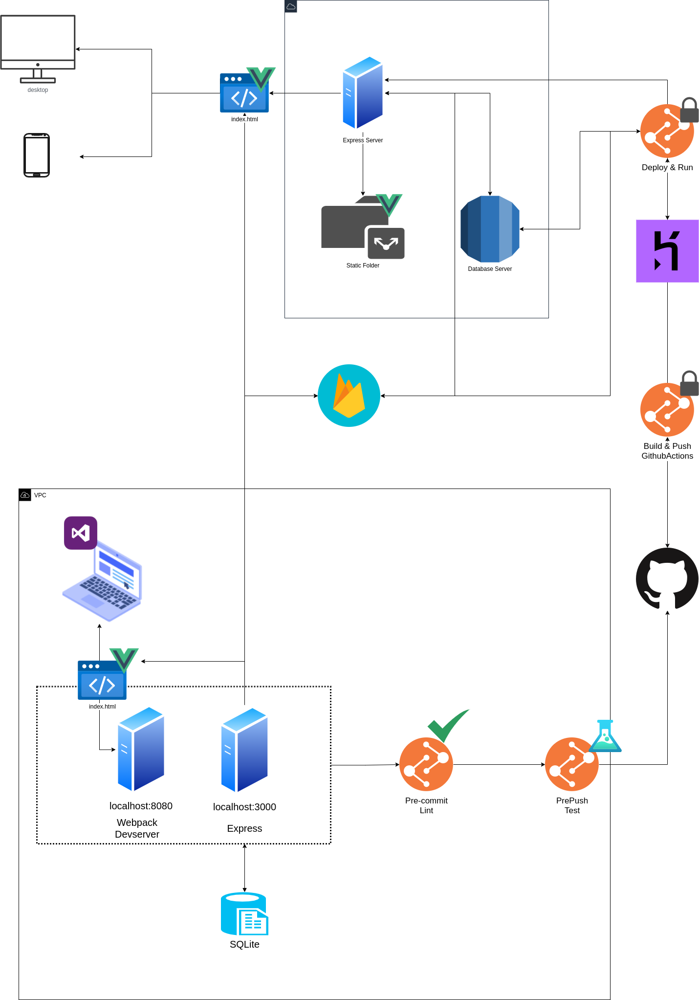
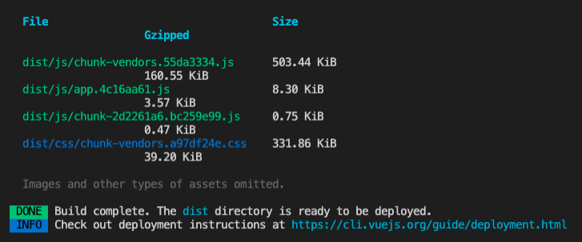

# Salida a producción utilizando Github Actions y Heroku

Ha sido un largo camino en el cuál hemos construido nuestra plataforma, integrado prácticas comunes de la comunidad Javascript, prácticas relacionadas a la agilidad de Software y varias técnicas de Ingeniería para mejorar nuestro código como el uso de tecnologías en las partes Frontend y Backend. Todo esto fue con el objetivo de poder poner a disposición de los usuarios nuestra plataforma de trueques. Pero hay una pregunta que quien haya seguido estos capítulos puede estar haciendose:

> ¿Es acaso un buen momento para salir a producción y disponibilizar la plataforma a los usuarios?

- La respuesta es sí.

- Pero si solamente tenemos un método de Autenticación y una página de lista de productos.

- OK. podemos salir a producción pero no mostrarle aún a los usuarios está página.

- Pero es necesario estandarizar desde una etapa temprana el procedimiento de subida a producción.

Para ello hay una serie de preguntas técnicas que debemos plantearnos.
Veremos si nuestra plataforma cumple al menos con los requerimiento básicos para esta etapa:

- ¿Cúal será el método por el cuál disponibilizaremos el Frontend para los usuarios de la plataforma?

- ¿Qué método de puesta en producción en servidores en la nube utilizaremos?

- ¿Qué tipo base de datos y servicio en la nube para almacenar datos utilizaremos?

- ¿Que requisitos debe cumplir el código fuente para salir a producción desde este punto en adelante?

Iremos respondiendo a cada una de estas pregunta e implementaremos lo necesario para lograr solucionar lo necesario para salir a producción sin problemas.


#### ¿Cúal será el método por el cuál disponibilizaremos el Frontend para los usuarios de la plataforma?

En esta oportunidad utilizaremos el enfoque de WEB SERVER + API en el mismo servidor NodeJS. Esto quiere decir que debemos incluir una carpeta en el servidor que contendrá en resultado del proyecto Frontend, esto es, un archivo index.html con los archivos Javascript y CSS, así como los recursos como imágenes, íconos, etc que queramos incluir.
De esta forma las peticiones hechas por la parte Frontend hacia el Backend utilizarán el mismo dominio.

La siguiente imagen muestra un diagrama que intenta explicar esta estrategia:



Para logra esto haremos 2 pasos:

1. Generar un proyecto Frontend listo para poner en producción
2. Agregar una carpeta pública en el proyecto Backend y el código necesario para exponerla a través de Express.

##### Generar un proyecto Frontend listo para poner en producción

Para lograr esto ingresaremos a la carpeta `frontend` a través de la terminal y correremos el siguiente comando:

```bash
npm run build -- --mode production
```
Deberíamos ver algo como lo que muestra la siguiente imagen:



Veremos aparecer una carpeta `dist` en la raíz del directorio `frontend` por lo cuál si accedemos a ella veremos los archivos generados por Vue además de un archivo `index.html` y `favicon.ico`. 

- agregar carpeta public en backend
- agregar código en app.js de express.static
- copiar todo el contenido de dist a public
- correr `npm start` en backend
- agregar al gitignore `backend/public` y explicar porque

#### ¿Qué método de puesta en producción en servidores en la nube utilizaremos?

- heroku crear cuenta
- heroku crear app
- comentar sobre imagenes docker en heroku con diagrama y enlaces a documentación

(sino tiene docker, puede saltarse la parte que sigue)
- agregar Dockerfile y probar en local la imagen de producción con docker run
- explicar como Heroku expondrá nuestra app y hacer analogía con lo hecho en local

#### ¿Qué tipo base de datos y servicio en la nube para almacenar datos utilizaremos?

- instalar postgres como dependencia del backend
- configurar sequelize para producción usando 
```javascript
"production": {
  "use_env_variable": "DATABASE_URL",
  "dialect": "postgres",
  "dialectOptions": {
    "ssl":{
      "rejectUnauthorized": false
    }
  },
  "logging": false
}
```
- crear el servicio de heroku desde ya y probar en local. poniendo temporarlmente las variables producción y database_url


#### ¿Que requisitos debe cumplir el código fuente para salir a producción desde este punto en adelante?

- github actions y variable de ambiente para deployment y seguridad

- subir archivo de service account a Firebase Hosting y explicar almacenamiento de secretos (y que esto es nivel básico)
- Pipeline y archivos bash de deployment en carpeta `ci` en la raíz
- Pull request, code review y agilidad etc
- push y mirar todo el proceso de puesta en producción con la interfaz de Github Actions

- Agregar datos utilizando una herramienta para postgres y corroborar los resultados en producción agregando productos.

<table>
  <tr>
    <th colspan="2">
      <span>⬅️ </span>
      <a href="./08-development-workflow-husky.md"> Flujo de desarrollo del proyecto
      </a>
    </th>
    <th colspan="2">
      <a href="../README.md">
        Volver al Índice del curso
        <span>➡️ </span>
      </a>
    </th>
  </tr>
</table>
